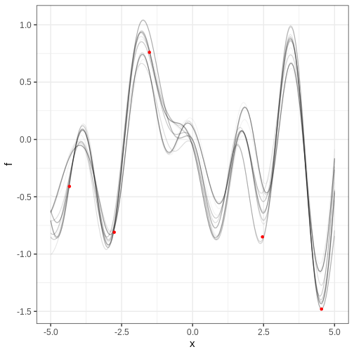
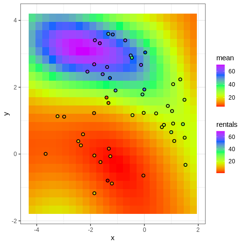

:::::::::::::::::::::::::::::::::::::: questions

- What are Gaussian processes?

::::::::::::::::::::::::::::::::::::::::::::::::

::::::::::::::::::::::::::::::::::::: objectives


- Non-parameteric regression


::::::::::::::::::::::::::::::::::::::::::::::::

# Gaussian process regression

Let's look at the $N = 5$ available data points. 


```r
N <- 5

x <- c(-2.76, 2.46, -1.52, -4.34, 4.54)
y <- c(-0.81, -0.85, 0.76, -0.41, -1.48)

df <- data.frame(x, y)

# Plot data
p_data <- df %>% 
  ggplot(aes(x,y)) + 
  geom_point()

p_data
```


Let's assume these are noisy observations from some unknown function $f$ and try to estimate this function by giving $f$ a Gaussian process prior. In other words, 

$$y \sim N(f, \sigma^2) \\
f \sim GP(\mu, K_{SE}(\lambda, \alpha)).$$

Above, $K_{SE}(\lambda, \alpha)$ is the squared exponential covariance kernel, which gives the covariance of input points $x_1$ and $x_2$: 

$$K_{SE}(x_1, x_2 ,\lambda, \alpha) = \alpha^2 \exp \left(-\frac{(x_1-x_2)^2}{2 \lambda^2} \right)$$


length-scale $\lambda$ and variance $\alpha^2$. The mean parameter is a zero-vector: $\mu = (0, 0, 0, 0, 0)$. 

This model is implemented in the Stan program `gp_sq_exp_pred.stan`.

In the inference, we'll learn the value of $f$ at the data locations and on a grid of values specified next


```r
N_pred <- 200
x_pred <- seq(-5, 5, length.out = N_pred)
```


Let's compile the model and generate the samples. The inference takes time (some minutes) even though there is only a single chain and 1000 iterations (obviously this is not enough!). There are also some convergence issues. Nevertheless, let's look at the output.


```stan

data {
  
  // Data
  int<lower=1> N_data;
  real y[N_data];
  real x_data[N_data];
  
  
  // GP hyperparameters
  real<lower=0> alpha;
  real<lower=0> lambda;
  
  // Observation error
  real<lower=0> sigma;
  
  // Prediction points
  int<lower=1> N_pred;
  real x_pred[N_pred];
}
transformed data {

  int<lower=1> N = N_data + N_pred;
  
  real x[N];
  matrix[N, N] K;
  
  x[1:N_data] = x_data;
  x[(N_data+1):N] = x_pred;

  // Covariance function
  K = gp_exp_quad_cov(x, alpha, lambda);
  
  
  
  // Trick: 
  // Add nugget on diagonal for numerical stability
  for (n in 1:N) {
    K[n, n] = K[n, n] + 1e-6;
  }


}
parameters {
  vector[N] f;
}

model {

  // Likelihood
  y ~ normal(f[1:N_data], sigma);

  // GP
  f ~ multi_normal(rep_vector(0, N), K);

}

```


```r
gp_samples <- rstan::sampling(gp_model,
                       list(N_data = N,
                            x_data = as.array(df$x),
                            y = as.array(df$y),
                            lambda = 0.75,
                            alpha = 1,
                            sigma = 0.1,
                            N_pred = N_pred,
                            x_pred = x_pred),
                       chains = 1, iter = 100, 
                       refresh = 500)
```

```{.output}

SAMPLING FOR MODEL 'anon_model' NOW (CHAIN 1).
Chain 1: 
Chain 1: Gradient evaluation took 0.00045 seconds
Chain 1: 1000 transitions using 10 leapfrog steps per transition would take 4.5 seconds.
Chain 1: Adjust your expectations accordingly!
Chain 1: 
Chain 1: 
Chain 1: WARNING: There aren't enough warmup iterations to fit the
Chain 1:          three stages of adaptation as currently configured.
Chain 1:          Reducing each adaptation stage to 15%/75%/10% of
Chain 1:          the given number of warmup iterations:
Chain 1:            init_buffer = 7
Chain 1:            adapt_window = 38
Chain 1:            term_buffer = 5
Chain 1: 
Chain 1: Iteration:  1 / 100 [  1%]  (Warmup)
Chain 1: Iteration: 51 / 100 [ 51%]  (Sampling)
Chain 1: Iteration: 100 / 100 [100%]  (Sampling)
Chain 1: 
Chain 1:  Elapsed Time: 3.104 seconds (Warm-up)
Chain 1:                2.111 seconds (Sampling)
Chain 1:                5.215 seconds (Total)
Chain 1: 
```

```{.warning}
Warning: There were 1 transitions after warmup that exceeded the maximum treedepth. Increase max_treedepth above 10. See
https://mc-stan.org/misc/warnings.html#maximum-treedepth-exceeded
```

```{.warning}
Warning: Examine the pairs() plot to diagnose sampling problems
```

```{.warning}
Warning: The largest R-hat is 2.11, indicating chains have not mixed.
Running the chains for more iterations may help. See
https://mc-stan.org/misc/warnings.html#r-hat
```

```{.warning}
Warning: Bulk Effective Samples Size (ESS) is too low, indicating posterior means and medians may be unreliable.
Running the chains for more iterations may help. See
https://mc-stan.org/misc/warnings.html#bulk-ess
```

```{.warning}
Warning: Tail Effective Samples Size (ESS) is too low, indicating posterior variances and tail quantiles may be unreliable.
Running the chains for more iterations may help. See
https://mc-stan.org/misc/warnings.html#tail-ess
```


```r
f_samples <- rstan::extract(gp_samples, "f")[["f"]] %>% 
  t %>% data.frame() %>% 
  mutate(x = c(df$x, x_pred))

f_samples_l <- f_samples %>% 
  gather(key = "sample", value = "f", -x)


p_f <- ggplot() +
  geom_line(
    data = f_samples_l,
    aes(x = x, y = f, group = sample),
    alpha = 0.05) +
  geom_point(data = df, 
             aes(x = x, y = y), color ="red") 

print(p_f)
```



## Cholesky parameterization

It is generally recommended, that an alternative parameterization for GPs is used [link]. This makes the inference considerable more efficient. 

Briefly, the idea of this parameterization is to write $f = \mu + L\eta$, where $\mu$ is the GP mean, $LL^T = K$ is the Cholesky decomposition of the covariance function, and $\eta \sim N(0, 1)$ . 

The Stan program `gp_sq_exp_pred_cholesky.stan` implements this parameterization. Let's compile and fit this model on the same data.


```stan
data {
  
  // Data
  int<lower=1> N_data;
  real y[N_data];
  real x_data[N_data];
  
  // GP hyperparameters
  real<lower=0> alpha;
  real<lower=0> lambda;
  
  // Observation error
  real<lower=0> sigma;
  
  // Prediction points
  int<lower=1> N_pred;
  real x_pred[N_pred];
}
transformed data {

  int<lower=1> N = N_data + N_pred;
  
  real x[N];
  matrix[N, N] K;
  matrix[N, N] L;
  
  x[1:N_data] = x_data;
  x[(N_data+1):N] = x_pred;


  // Covariance function
  K = gp_exp_quad_cov(x, alpha, lambda);
  
  // Add nugget on diagonal for numerical stability
  for (n in 1:N) {
    K[n, n] = K[n, n] + 1e-6;
  }

  L = cholesky_decompose(K);
}

parameters {
  vector[N] eta;
}

transformed parameters {
  // Signal
  vector[N] f = L*eta;
}
model {

  // Likelihood
  y ~ normal(f[1:N_data], sigma);

  // GP
  eta ~ normal(0, 1);
  
}

```


```r
gp_cholesky_samples <- rstan::sampling(gp_cholesky_model,
                       list(N_data = N,
                            x_data = as.array(df$x),
                            y = as.array(df$y),
                            lambda = 0.75,
                            alpha = 1,
                            sigma = 0.1,
                            N_pred = N_pred,
                            x_pred = x_pred),
                       chains = 2, iter = 2000, 
                       refresh = 500)
```

```{.output}

SAMPLING FOR MODEL 'anon_model' NOW (CHAIN 1).
Chain 1: 
Chain 1: Gradient evaluation took 0.000193 seconds
Chain 1: 1000 transitions using 10 leapfrog steps per transition would take 1.93 seconds.
Chain 1: Adjust your expectations accordingly!
Chain 1: 
Chain 1: 
Chain 1: Iteration:    1 / 2000 [  0%]  (Warmup)
Chain 1: Iteration:  500 / 2000 [ 25%]  (Warmup)
Chain 1: Iteration: 1000 / 2000 [ 50%]  (Warmup)
Chain 1: Iteration: 1001 / 2000 [ 50%]  (Sampling)
Chain 1: Iteration: 1500 / 2000 [ 75%]  (Sampling)
Chain 1: Iteration: 2000 / 2000 [100%]  (Sampling)
Chain 1: 
Chain 1:  Elapsed Time: 0.821 seconds (Warm-up)
Chain 1:                0.723 seconds (Sampling)
Chain 1:                1.544 seconds (Total)
Chain 1: 

SAMPLING FOR MODEL 'anon_model' NOW (CHAIN 2).
Chain 2: 
Chain 2: Gradient evaluation took 4e-05 seconds
Chain 2: 1000 transitions using 10 leapfrog steps per transition would take 0.4 seconds.
Chain 2: Adjust your expectations accordingly!
Chain 2: 
Chain 2: 
Chain 2: Iteration:    1 / 2000 [  0%]  (Warmup)
Chain 2: Iteration:  500 / 2000 [ 25%]  (Warmup)
Chain 2: Iteration: 1000 / 2000 [ 50%]  (Warmup)
Chain 2: Iteration: 1001 / 2000 [ 50%]  (Sampling)
Chain 2: Iteration: 1500 / 2000 [ 75%]  (Sampling)
Chain 2: Iteration: 2000 / 2000 [100%]  (Sampling)
Chain 2: 
Chain 2:  Elapsed Time: 0.804 seconds (Warm-up)
Chain 2:                0.715 seconds (Sampling)
Chain 2:                1.519 seconds (Total)
Chain 2: 
```
Fitting is completed in a few seconds with no warnings. Let's check the results


```r
f_cholesky_samples <- rstan::extract(gp_cholesky_samples, "f")[["f"]] %>% 
  t %>% data.frame() %>% 
  mutate(x = c(df$x, x_pred))

f_cholesky_samples_l <- f_cholesky_samples %>% 
  gather(key = "sample", value = "f", -x)


p_cholesky_f <- ggplot() +
  geom_line(
    data = f_cholesky_samples_l,
    aes(x = x, y = f, group = sample),
    alpha = 0.05) +
  geom_point(data = df, 
             aes(x = x, y = y), color ="red") 

print(p_cholesky_f)
```


# 2D Gaussian processes

The input space of a GP can have any dimensionality $D$, $x \in \mathbb{R}^D.$ Conceptually, nothing changes. In the covariance function the distance between points $(x_1 - x_2)$ is simply computed using the Eucledian distance (Pythagorean theorem) between $x_1, x_2 \in \mathbb{R}^D$. Next we'll analyze some data using a 2D GP.

Assume that we have data on 50 randomly chosen homestay apartments in a city center. We know the coordinates $(x_1, x_2)$ on map and the amount of rentals last year $y$ for these apartments. We'd like to estimate popularity of different city areas based on this data. 

The data looks like this: 


The model we are using is specified as follows: 

$$y \sim Poisson(\phi) \\
\phi = \exp(a + f) \\
f \sim GP(\mu, K_{SE}(\alpha, \lambda)) \\
a \sim N(0, 1)$$

Here, $\phi$ is the average rental rate for a given point on map. The parameter $a$ functions as an intercept. We'll estimate $\phi$ for a 2D grid specified as follows: 


```r
by <- 0.25
x_pred <- expand.grid(x = seq(range(x)[1]-2*by, range(x)[2]+2*by, by = by), 
                      y = seq(range(y)[1]-2*by, range(y)[2]+2*by, by = by))
```

Let's call Stan. The program uses the Cholesky parameterization and generates the predicted values of $\phi$ in the generated quantities block. 


```stan
data {
  int<lower=1> N_data;
  int<lower=1> D;
  
  vector[D] x_data[N_data]; // x,y-coordinates
  int y[N_data]; // yearly rentals

  int<lower=1> N_pred;
  vector[D] x_pred[N_pred];
  
  real<lower=0> length_scale;
  real<lower=0> alpha;

  
}

transformed data {
  
  int<lower=1> N = N_data + N_pred;
  vector[D] x[N_data + N_pred];
  vector[N] mu;
  real nugget = 1e-9;
  
  matrix[N, N] K;
  matrix[N, N] L;
  
  mu = rep_vector(0, N);
  
  for(i in 1:N_data) x[i] = x_data[i];
  for(i in 1:N_pred) x[i + N_data] = x_pred[i];
  

  
  K = cov_exp_quad(x, alpha, length_scale);
  
  for (n in 1:N)
    K[n, n] = K[n, n] + nugget;

  L = cholesky_decompose(K);
  
}


parameters {
  vector[N] eta;

  // intercept
  real a;
}

transformed parameters {
  vector[N] f = mu + L*eta;
}


model {
  
  y ~ poisson_log(a + f[1:N_data]);
  
  eta ~ std_normal();
  a ~ normal(0, 1);

}
generated quantities {
  
  vector[N_pred] phi;
  
  for(i in 1:N_pred) {
    phi[i] = exp(a + f[N_data + i]);
  }

}

```


```r
samples <- rstan::sampling(gp_2d_poisson_model, 
         list(N_data = N,
              D = 2,
              N_pred = nrow(x_pred), 
              x_pred = x_pred,
              x_data = df[, c("x", "y")],
              y = df$rentals,
              length_scale = 2, 
              alpha = 1), 
         chains = 2, iter = 2000, 
         cores = 2, refresh = 500
         )
```

Again, the fitting takes some time, as there are >1000 points where $f$ is estimated.  (GPs scale in $O\{n^3\}$, that is, badly).

The figure below displays the posterior average of $\phi$ along with the data points. The rental hotspot of the city seems to be at approximately (-2, 3). 


```r
phi_summary <- rstan::summary(samples, "phi")$summary %>%
  data.frame() %>% 
  mutate(x = c(x_pred$x),
         y = c(x_pred$y)) 

p_phi_posterior_mean <- ggplot() +
  geom_tile(data = phi_summary,
            aes(x, y, fill = mean)) +
  geom_point(data = df,
             aes(x, y), size = 3) +
  geom_point(data = df,
            aes(x, y, color = rentals)) +
  scale_fill_gradientn(colors = rainbow(5)) + 
  scale_color_gradientn(colors = rainbow(5))
  
print(p_phi_posterior_mean)
```




::::::::::::::::::::::::::::::::::::: keypoints 

- point 1

::::::::::::::::::::::::::::::::::::::::::::::::

