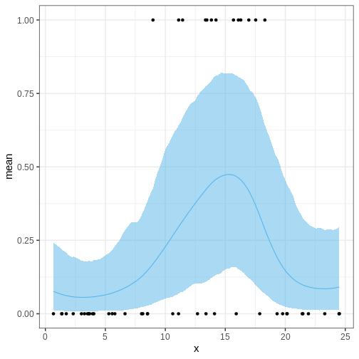

:::::::::::::::::::::::::::::::::::::: questions

- How to do probabilistic non-parameteric regression?

::::::::::::::::::::::::::::::::::::::::::::::::

::::::::::::::::::::::::::::::::::::: objectives

- Learn to perform Gaussian process regression with Stan

::::::::::::::::::::::::::::::::::::::::::::::::

Gaussian processes (GPs) are a class of stochastic (random) processes that are widely used for non-parametric regression, that is, when the relationship between the predictors and the dependent variable has no parametric form. Formally, a Gaussian process $GP(\mu, K)$ is defined as a collection of random variables $X$ with the property that any finite subset $X_I \subset X$ follows a multivariate normal distribution with mean $\mu$ and covariance $K$. 

This definition implies a distribution over functions, meaning that generating a realization from a GP produces a function. This in turn implies that GPs can be used as priors for unknown functional forms between variables. 

As an example, consider modeling crop yields as a function of fertilizer use. Presumably, there exists a non-linear trend between these variables, as insufficient or excessive fertilizer use will lead to suboptimal yields. In the absence of a parametric model, GPs can function as a prior for the relationship between fertilizer and yield, $f$. In its simplest form, measured yields $y$ could be modeled as noisy observations from $f(x)$, where $x$ is the amount of fertilizer used:

$$\begin{align}
y &\sim N(f(x), \sigma^2) \\ 
f(x) &\sim GP(\mu, K).
\end{align} $$

As with all priors, the chosen hyperparameters (here $\mu, \, K$) influence the inference. The mean parameter $\mu$ defines the average level of the process, while the covariance function $K$ exerts a more defining effect on the process characteristics.

Perhaps the most frequently used covariance function is the squared exponential kernel $K_{SE}(x, x’) = \alpha^2 \exp{ \frac{(x - x’)^2}{2 \lambda} }$. The parameter $\alpha^2$ sets the variance of the process, while $\lambda$ determines the scale of the correlation; increasing $\lambda$ increases the correlation between $x$ and $x’$. In the figure below, we've plotted some realizations from a GP with $\mu = (0, 0, \ldots, 0)$ and squared exponential covariance function with $\alpha = 1$ and $\lambda = 25$. The input space $X$ is the integers between 0 and 100. 


``` r
set.seed(6436)

sq_exp_cov <- function(x, lambda, alpha) {
  n <- length(x)
  
  K <- matrix(0, n, n)
  
  for (i in 1:n) {
    for (j in 1:n) {
      diff <- sqrt(sum((x[i] - x[j])^2))
      K[i,j] <- alpha^2 * exp(-diff^2 / (2 * lambda^2))
    }
  }

  return(K)
}

x <- 0:100
alpha <- 1
lambda <- 25

# Sample from multivariate normal
gp_samples <- rmvnorm(10, sigma = sq_exp_cov(x, lambda, alpha))

gp_samples_l <- gp_samples %>%
  t %>% 
  data.frame %>% 
  mutate(x = seq(0, 100, by = 1)) %>% 
  gather(key = "sample", value = "y", -x)


gp_sample_p <- ggplot(data = gp_samples_l) +
  geom_line(aes(x = x, y = y, group = sample))


print(gp_sample_p)
```


:::::::::::::::::::: challenge
1. Generate samples from the GP above with different values of $\alpha$ and $\lambda$ to get intuition about the role of these hyperparameters.


2. Implement the exponential covariance kernel defined as $K_{exp}(x, x’) = \alpha^2 \exp{ \frac{|x - x’|}{\lambda} }$ and generate samples using this kernel. What is the qualitative difference to samples generated with squared exponential covariance?
::::::::::::::::::::::::::::::


Next, we'll explore some examples that make use of Gaussian processes.

## Example 1: Gaussian process regression

Assume we'd like to estimate the relationship between variables $x$ and $y$ based on the following 5 data points.


``` r
df6 <- data.frame(x = c(-2.76, 2.46, -1.52, -4.34, 4.54,  1),
                 y = c(-0.81, -0.85, 0.76, -0.41, -1.48,  0.2))

# Plot 
p_data <- df6 %>% 
  ggplot(aes(x,y)) + 
  geom_point()

p_data
```


We'll assume $y$ are noisy observations from some unknown function $f(x)$ for which we'll give a GP prior. Because we will not recover any functional (such as polynomial) form for $f$, we will only learn the value of $f$ at separate predetermined locations $x$. The covariance function needs to be computed in all those points. Let's estimate $f$ on a grid of points spanning the interval (-5, 5), stored in vector `x_pred`:


``` r
x_pred <- seq(-5, 5, by = 0.1)
N_pred <- length(x_pred)
```

Next we'll build the Stan program. The model structure is simple: the model block defines the likelihood as the normal distribution with mean $f(x)$: `y ~ normal(f[1:N_data], sigma)`. Notice that this is a vectorized statement so the mean $y_i$ equals $f(x_i)$ for all $i$. 

The parameter vector `f` contains the values of $f$ corresponding to the data points, in addition to the locations where we want interpolate. The covariance function is computed in the transformed data block, where first a vector of concatenated data and prediction locations is build. For computational stability, it is customary to add a small value on the diagonal of the covariance matrix. This ensures that the matrix is positive semi-definite. 

Take a moment to digest the structure of the Stan program. 


``` stan
data {
  // Data
  int<lower=1> N_data;
  real y[N_data];
  real x_data[N_data];
  
  // GP hyperparameters
  real<lower=0> alpha;
  real<lower=0> lambda;
  
  // Observation error
  real<lower=0> sigma;
  
  // Prediction points
  int<lower=1> N_pred;
  real x_pred[N_pred];
}
transformed data {
  // Number of data and prediction points
  int<lower=1> N = N_data + N_pred;
  
  real x[N];
  matrix[N, N] K;
  
  x[1:N_data] = x_data;
  x[(N_data+1):N] = x_pred;

  // Covariance function
  K = gp_exp_quad_cov(x, alpha, lambda);

  // Add nugget on diagonal for numerical stability
  for (n in 1:N) {
    K[n, n] = K[n, n] + 1e-6;
  }

}
parameters {
  vector[N] f;
}
model {
  // Likelihood
  y ~ normal(f[1:N_data], sigma);
  // GP prior
  f ~ multi_normal(rep_vector(0, N), K);
}

```


Let's fit the model. We'll use hyperparameter values $\lambda = 1$, $\alpha = 1$ and set the observation error standard deviation to $\sigma = 0.1$. 


``` r
# Fit
gp_samples <- rstan::sampling(gp_model,
                       list(N_data = nrow(df6),
                            x_data = as.array(df6$x),
                            y = as.array(df6$y),
                            lambda = 1,
                            alpha = 1,
                            sigma = 0.1,
                            N_pred = N_pred,
                            x_pred = x_pred),
                       chains = 1, iter = 1000)
```

``` output

SAMPLING FOR MODEL 'anon_model' NOW (CHAIN 1).
Chain 1: 
Chain 1: Gradient evaluation took 8.4e-05 seconds
Chain 1: 1000 transitions using 10 leapfrog steps per transition would take 0.84 seconds.
Chain 1: Adjust your expectations accordingly!
Chain 1: 
Chain 1: 
Chain 1: Iteration:   1 / 1000 [  0%]  (Warmup)
Chain 1: Iteration: 100 / 1000 [ 10%]  (Warmup)
Chain 1: Iteration: 200 / 1000 [ 20%]  (Warmup)
Chain 1: Iteration: 300 / 1000 [ 30%]  (Warmup)
Chain 1: Iteration: 400 / 1000 [ 40%]  (Warmup)
Chain 1: Iteration: 500 / 1000 [ 50%]  (Warmup)
Chain 1: Iteration: 501 / 1000 [ 50%]  (Sampling)
Chain 1: Iteration: 600 / 1000 [ 60%]  (Sampling)
Chain 1: Iteration: 700 / 1000 [ 70%]  (Sampling)
Chain 1: Iteration: 800 / 1000 [ 80%]  (Sampling)
Chain 1: Iteration: 900 / 1000 [ 90%]  (Sampling)
Chain 1: Iteration: 1000 / 1000 [100%]  (Sampling)
Chain 1: 
Chain 1:  Elapsed Time: 32.042 seconds (Warm-up)
Chain 1:                36.412 seconds (Sampling)
Chain 1:                68.454 seconds (Total)
Chain 1: 
```

``` warning
Warning: There were 492 transitions after warmup that exceeded the maximum treedepth. Increase max_treedepth above 10. See
https://mc-stan.org/misc/warnings.html#maximum-treedepth-exceeded
```

``` warning
Warning: Examine the pairs() plot to diagnose sampling problems
```

``` warning
Warning: The largest R-hat is 2.11, indicating chains have not mixed.
Running the chains for more iterations may help. See
https://mc-stan.org/misc/warnings.html#r-hat
```

``` warning
Warning: Bulk Effective Samples Size (ESS) is too low, indicating posterior means and medians may be unreliable.
Running the chains for more iterations may help. See
https://mc-stan.org/misc/warnings.html#bulk-ess
```

``` warning
Warning: Tail Effective Samples Size (ESS) is too low, indicating posterior variances and tail quantiles may be unreliable.
Running the chains for more iterations may help. See
https://mc-stan.org/misc/warnings.html#tail-ess
```


The inference takes some time (about a minute on a standard laptop) even though we only use (an insufficient) single chain and 1000 iterations. Stan also throws warnings about convergence issues. Let's ignore these at this point, and look at the output.


``` r
f_samples <- rstan::extract(gp_samples, "f")[["f"]] %>% 
  t %>% data.frame() %>% 
  mutate(x = c(df6$x, x_pred)) # data and prediction locations

f_samples_l <- f_samples %>% 
  gather(key = "sample", value = "f", -x)

p_f <- ggplot() +
  geom_line(
    data = f_samples_l,
    aes(x = x, y = f, group = sample),
    alpha = 0.05) +
  geom_point(data = df6, 
             aes(x = x, y = y), color ="red") 

print(p_f)
```


The figure contains the data points in red and samples from the posterior distribution of $f$ in black. Each posterior sample corresponds to a function. This distribution essentially captures the model's interpretation of the underlying trend within the data. The estimate for the trend seems plausible. 

:::::::::::::::::::::::::::::: challenge
In the figure above, where is the posterior uncertainty the highest and why? What controls the uncertainty at the locations of the data? If we made the prediction range wider, say, from -10 to 10, what would the posterior  look like at the extremes?

::::::::::::::::::::::: solution
Uncertainty grows at locations away from the data points and starts to resemble the prior. At the data locations, the uncertainty is controlled by the parameter $\sigma$. Far from the data, the posterior would be centered around 0 and have variance $\alpha^2$. 
::::::::::::::::::::::::::::::::

::::::::::::::::::::::::::::::::::::::::


## Cholesky parameterization

Running the previous example look a few minutes even though the amount data and number of prediction locations was modest. Scalability is a weak point of Gaussian processes but luckily there is a trick that can be used to speed up the inference and to improve convergence.

By using the Cholesky decomposition of the covariance function $K = LL^T$, the target function $f$ can be reparameterized as $f = \mu + L\eta$. Now, if the random variable $\eta$ is distributed as multivariate normal with mean 0 and identity covariance matrix, it implies that $f \sim GP(\mu, K)$. 
 
The Stan program below implements this parameterization. The Cholesky decomposition is performed at the end of the transformed data block and the reparameterization in the transformed parameters block. The likelihood statement is unchanged but prior is now given for $\eta$. Other parts of the program are identical to the previous example.


``` stan
data {
  // Data
  int<lower=1> N_data;
  real y[N_data];
  real x_data[N_data];
  
  // GP hyperparameters
  real<lower=0> alpha;
  real<lower=0> lambda;
  
  real<lower=0> sigma;
  
  // Prediction points
  int<lower=1> N_pred;
  real x_pred[N_pred];
}
transformed data {
  int<lower=1> N = N_data + N_pred;
  
  real x[N];
  matrix[N, N] K;
  matrix[N, N] L;
  
  x[1:N_data] = x_data;
  x[(N_data+1):N] = x_pred;

  // Covariance function
  K = gp_exp_quad_cov(x, alpha, lambda);
  
  // Add nugget on diagonal for numerical stability
  for (n in 1:N) {
    K[n, n] = K[n, n] + 1e-6;
  }

  L = cholesky_decompose(K);
}
parameters {
  vector[N] eta;
}
transformed parameters {
  // mu = (0, 0, ..., 0)
  vector[N] f = L*eta;
}
model {
  // Likelihood
  y ~ normal(f[1:N_data], sigma);
  // GP
  eta ~ normal(0, 1);
}

```

Let's compile and fit this model using the same data. Fitting is completed in a few seconds with no convergence issues: 


``` r
gp_cholesky_samples <- rstan::sampling(gp_cholesky_model,
                       list(N_data = nrow(df6),
                            x_data = as.array(df6$x),
                            y = as.array(df6$y),
                            lambda = 1,
                            alpha = 1,
                            sigma = 0.1,
                            N_pred = N_pred,
                            x_pred = x_pred),
                       chains = 1, iter = 2000, 
                       refresh = 0)
```


Let's examine the results. How is the posterior different from the one recovered without the Cholesky parameterization?


``` r
f_cholesky_samples <- rstan::extract(gp_cholesky_samples, "f")[["f"]] %>% 
  t %>% data.frame() %>% 
  mutate(x = c(df6$x, x_pred))

f_cholesky_samples_l <- f_cholesky_samples %>% 
  gather(key = "sample", value = "f", -x)

p_cholesky_f <- ggplot() +
  geom_line(
    data = f_cholesky_samples_l,
    aes(x = x, y = f, group = sample),
    alpha = 0.05) +
  geom_point(data = df6, 
             aes(x = x, y = y), color ="red") 

print(p_cholesky_f)
```


:::::::::::::::::::::::: challenge

For the previous example, compute the posterior probability for $f(0) > 0$. 

:::::::::::::::: solution


``` r
# Marginal posterior at x == 0
posterior_at_0 <- f_cholesky_samples_l %>%
  filter(x == 0)

mean(posterior_at_0 > 0)
```

``` output
[1] 0.6006667
```


::::::::::::::::::::::::

::::::::::::::::::::::::::::::::::


## Example 2: Logistic Gaussian process regression

Gaussian processes can also be used as priors in models where the relationship between the explanatory and response variables is more complex.

Consider, for example, predicting the presence of some insect species in different regions based on average annual temperature. Now the response variable $y$ is binary with $y=0$ and $y=1$ corresponding to absence and presence, respectfully.


The following simulated data contains observations from 40 locations including presence/absence observations for an insect species and yearly average temperature. Plotting the data suggests there is a temperature range where the species can exists.


``` r
insect <- data.frame(
  x = c(1.74, 13.46, 3.69, 16.09, 8.52, 11.11, 19.32, 5.79, 11.44, 2.32, 0.67, 23.29, 14.1, 16.96, 16.29, 20.16, 12.68, 3.61, 14.22, 11.1, 8.02, 13.35, 24.48, 4.04, 21.41, 6.64, 1.36, 8.97, 17.87, 3.51, 15.68, 8.12, 1.38, 13.39, 3.01, 13.84, 5.29, 20.13, 5.57, 24.51, 3.94, 17.53, 10.62, 3.26, 19.78, 21.93, 21.47, 18.3, 15.91, 8.51),
  y = c(0, 1, 0, 1, 0, 1, 0, 0, 1, 0, 0, 0, 0, 1, 1, 0, 0, 0, 1, 0, 0, 1, 0, 0, 0, 0, 0, 1, 0, 0, 1, 0, 0, 0, 0, 1, 0, 0, 0, 0, 0, 1, 0, 0, 0, 0, 0, 1, 0, 0)
)

p <- insect %>%
  ggplot() +
  geom_point(aes(x, y))

print(p)
```


One way of modeling presence/absence data is with logistic regression:

$$ y \sim \text{Bernoulli}(\theta) \\
\theta = \frac{1}{1 + e^{-(\alpha + \beta x)}},$$ where $\alpha, \beta$ are real numbers and $\theta$ is the probability of $y = 1$.

However, in this standard form, the relationship between temperature and presence is monotonous: assuming $\beta > 0$, higher temperatures imply higher probability of presence. This is in disagreement with the data and, of course, with reality. For this reason, we will modify the model so that the term $\beta x$ is replaced with a non-parametric function $f(x)$, that is given a GP prior. For the baseline parameter $\alpha$, we will use a normal prior $N(0, 10)$. 

In the model block, we utilize the built-in Stan function `bernoulli_logit` to write the likelihood statement. The probability of presence as a function of temperature $\theta$ is generated in the generated quantities block.


``` stan
data {
  // Data
  int<lower=1> N_data;
  int<lower=0, upper=1> y[N_data];
  real x_data[N_data];

  // Prediction points
  int<lower=1> N_pred;
  real x_pred[N_pred];

  // GP hyperparameters
  real<lower=0> alpha;
  real<lower=0> lambda;
}
transformed data {
  int<lower=1> N = N_data + N_pred;

  real x[N];
  matrix[N, N] K;
  matrix[N, N] L;

  x[1:N_data] = x_data;
  x[(N_data+1):N] = x_pred;

  // Covariance function
  K = gp_exp_quad_cov(x, alpha, lambda);

  // Add nugget on diagonal for numerical stability
  for (n in 1:N) {
    K[n, n] = K[n, n] + 1e-6;
  }

  L = cholesky_decompose(K);

}
parameters {
  real a;
  vector[N] eta;
}
transformed parameters {
  // mu = (0, 0, ..., 0)
  vector[N] f = L*eta;
}
model {

  // Likelihood
  y ~ bernoulli_logit(a + f[1:N_data]);
  // Priors
  a ~ normal(0, 10);
  eta ~ normal(0, 1);
}
generated quantities{
  vector[N] theta = 1 / (1 + exp(-(alpha + f)));
}

```


Let's fit the model and extract the posterior summary of $\theta$.


``` r
x_pred <- seq(min(insect$x), max(insect$x), length.out = 100)
N_pred <- length(x_pred)

logistic_gp_fit <- rstan::sampling(logistic_gp_model,
                                   list(N_data = nrow(insect),
                                        y = insect$y,
                                        x_data = insect$x,
                                        alpha = 1,
                                        lambda = 3,
                                        N_pred = N_pred,
                                        x_pred = x_pred),
                                   refresh = 0)

theta_summary <- rstan::summary(logistic_gp_fit, "theta")$summary %>%
  data.frame() %>%
  select(lower_2.5 = X2.5., mean, upper_97.5 = X97.5.) %>%
  mutate(x = c(insect$x, x_pred))
```


Then we'll look at the posterior of $\theta$, the probability of presence of the species and overlay it with the data. The posterior looks reasonable in the sense that the posterior of $\theta$ is higher in the temperature range where presence was observed. However, the posterior values seem too high across the temperature range and, moreover, start veering up at the ends. Why might this be?


``` r
p_theta <-
  ggplot() +
  geom_ribbon(data = theta_summary,
              aes(x = x, ymin = lower_2.5, ymax = upper_97.5),
              fill = posterior_color, alpha = 0.5) +
  geom_line(data = theta_summary,
            aes(x = x, y = mean), color = posterior_color) +
  geom_point(data = insect,
             aes(x = x, y = y))

p_theta
```


::::::::::::::::::::::::::::::::::: challenge
Think of ways to modify the Stan program for the logistic GP regression so that the posterior behavior is more reasonable in the prediction range.

::::::::::::::::: solution

Let's modify the program by setting the GP mean to a negative value and treating the length scale as a parameter.


``` stan
data {
  // Data
  int<lower=1> N_data;
  int<lower=0, upper=1> y[N_data];
  real x_data[N_data];

  // Prediction points
  int<lower=1> N_pred;
  real x_pred[N_pred];

  real<lower=0> alpha;
}
transformed data {
  int<lower=1> N = N_data + N_pred;
  real x[N];
  x[1:N_data] = x_data;
  x[(N_data+1):N] = x_pred;
}
parameters {
  real a;
  vector[N] eta;
  real<lower=0> lambda;
}
transformed parameters {

  matrix[N, N] K;
  matrix[N, N] L;
  vector[N] f;

  // Covariance function
  K = gp_exp_quad_cov(x, alpha, lambda);

  // Add nugget on diagonal for numerical stability
  for (n in 1:N) {
    K[n, n] = K[n, n] + 1e-6;
  }

  L = cholesky_decompose(K);
  f = rep_vector(-3, N) + L*eta;
}
model {
  // Likelihood
  y ~ bernoulli_logit(a + f[1:N_data]);
  // Priors
  a ~ normal(0, 10);
  eta ~ normal(0, 1);
  lambda ~ gamma(2, 1);
}
generated quantities{
  vector[N] theta = 1 / (1 + exp(-(alpha + f)));
}

```

Refit the model and check posterior


``` r
logistic_gp_fit2 <- rstan::sampling(logistic_gp_model2,
                                   list(N_data = nrow(insect),
                                        y = insect$y,
                                        x_data = insect$x,
                                        alpha = 1,
                                        N_pred = N_pred,
                                        x_pred = x_pred),
                                   chains = 1)
```

``` output

SAMPLING FOR MODEL 'anon_model' NOW (CHAIN 1).
Chain 1: 
Chain 1: Gradient evaluation took 0.001344 seconds
Chain 1: 1000 transitions using 10 leapfrog steps per transition would take 13.44 seconds.
Chain 1: Adjust your expectations accordingly!
Chain 1: 
Chain 1: 
Chain 1: Iteration:    1 / 2000 [  0%]  (Warmup)
Chain 1: Iteration:  200 / 2000 [ 10%]  (Warmup)
Chain 1: Iteration:  400 / 2000 [ 20%]  (Warmup)
Chain 1: Iteration:  600 / 2000 [ 30%]  (Warmup)
Chain 1: Iteration:  800 / 2000 [ 40%]  (Warmup)
Chain 1: Iteration: 1000 / 2000 [ 50%]  (Warmup)
Chain 1: Iteration: 1001 / 2000 [ 50%]  (Sampling)
Chain 1: Iteration: 1200 / 2000 [ 60%]  (Sampling)
Chain 1: Iteration: 1400 / 2000 [ 70%]  (Sampling)
Chain 1: Iteration: 1600 / 2000 [ 80%]  (Sampling)
Chain 1: Iteration: 1800 / 2000 [ 90%]  (Sampling)
Chain 1: Iteration: 2000 / 2000 [100%]  (Sampling)
Chain 1: 
Chain 1:  Elapsed Time: 17.508 seconds (Warm-up)
Chain 1:                17.549 seconds (Sampling)
Chain 1:                35.057 seconds (Total)
Chain 1: 
```

``` r
theta_summary2 <- rstan::summary(logistic_gp_fit2, "theta")$summary %>%
  data.frame() %>%
  select(lower_2.5 = X2.5., mean, upper_97.5 = X97.5.) %>%
  mutate(x = c(insect$x, x_pred))

p_theta2 <-
  ggplot() +
  geom_ribbon(data = theta_summary2,
              aes(x = x, ymin = lower_2.5, ymax = upper_97.5),
              fill = posterior_color, alpha = 0.5) +
  geom_line(data = theta_summary2,
            aes(x = x, y = mean), color = posterior_color) +
  geom_point(data = insect,
             aes(x = x, y = y))

p_theta2
```




::::::::::::::::::::::::::

:::::::::::::::::::::::::::::::::::::::::::::

::::::::::::::::::::::::::::::::::: challenge
Generate a posterior for the optimal temperature. 
:::::::::::::::::::::::::::::::::::::::::::::


::::::::::::::::::::::::::::::::::::: keypoints 

- GPs provide a means for non-parametric regression. 
- A GP has two parameters: mean, and covariance. 
- GPs can be used a part of more complex models. 

::::::::::::::::::::::::::::::::::::::::::::::::

