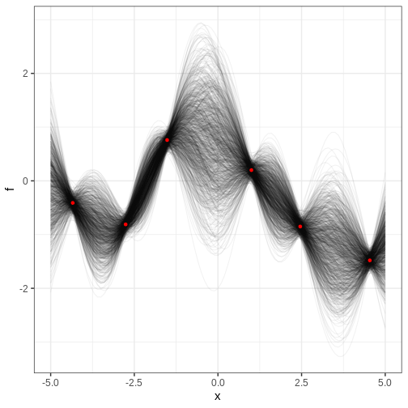

:::::::::::::::::::::::::::::::::::::: questions

- How to do probabilistic non-parameteric regression?

::::::::::::::::::::::::::::::::::::::::::::::::

::::::::::::::::::::::::::::::::::::: objectives

- Learn to perform Gaussian process regression with Stan

::::::::::::::::::::::::::::::::::::::::::::::::

Gaussian processes (GPs) represent a class of stochastic (random) processes widely employed for non-parametric regression.

Formally, a Gaussian process $GP(\mu, \Sigma)$ is characterized as a collection of random variables $X$ such that any finite subset $X_I \subset X$ follows a multivariate normal distribution with mean $\mu$ and covariance $\Sigma$. Generating a sample from a GP yields a random function $X_I \to \mathbb{R}$, and this feature
enables using GPs as prior distributions for functions.

As an example, consider the modeling of crop yields as a function of fertilizer use. Presumably, there exists a non-linear trend between these variables, as insufficient or excessive fertilizer may lead to suboptimal yields. In the absence of a parametric mechanistic model, GPs can function as a prior for the relationship $f$ between fertilizer and yield. In its simplest form, measured yields could be modeled as noisy observations from $f$:
$$ f(x) \sim GP(\mu, \Sigma),$$

where $x$ represents the amount of fertilizer used. 

As with all priors, the chosen hyperparameters (here $\mu, \, \Sigma$) influence the inference. The mean parameter $\mu$ defines the average level of the process, while the covariance function $\Sigma$ exerts a more defining effect on the process characteristics.

Perhaps the most frequently used covariance function is the squared exponential kernel $K_{SE}(x, x’) = \alpha^2 \exp^{ \frac{(x - x’)^2}{2 \lambda} }$. The parameter $\alpha$ sets the variance of the process, and $\lambda$ determines the scale of the correlation; increasing $\lambda$ increases the correlation between $x$ and $x’$. In the figure below, we've plotted some realizations from a GP with $\mu = (0, 0, \ldots, 0)$ and squared exponential covariance function with $\alpha = 1$ and $\lambda = 25$. The input space $X_I$ is the integers between 0 and 100. 


:::::::::::::::::::: challenge
Generate samples from the GP above with different values of $\alpha$ and $\lambda$ to get intuition about the role of these hyperparameters.
::::::::::::::::::::::::::::::


Next, we'll explore some simple examples that leverage Gaussian processes.

## Gaussian process regression

Assume we have 5 data available and wed like to estimate a trend in the data. 


```r
df <- data.frame(x = c(-2.76, 2.46, -1.52, -4.34, 4.54,  1),
                 y = c(-0.81, -0.85, 0.76, -0.41, -1.48,  0.2))

N <- nrow(df)

# Plot data
p_data <- df %>% 
  ggplot(aes(x,y)) + 
  geom_point()

p_data
```


Let's assume these are noisy observations from some unknown function $f$ and try to estimate this function by giving $f$ a Gaussian process prior with the squared exponential covariance function. 

The covariance function should be computed using the data points $x$ and all those locations where we want to predict the value of $f$. Let's predict the $f$ on a grid of points spanning the interval (-5, 5). The grid points are stored in vector `x_pred`


```r
N_pred <- 200
x_pred <- seq(-5, 5, length.out = N_pred)
```

Next we'll build the Stan program. The model structure is simple; the model block defines the likelihood as the normal distribution with an unknown mean: `y ~ normal(f[1:N_data], sigma);`. Notice that this is a vectorized statement so the mean of each $y_i$ equals $f_i$. 

The parameter vector `f` contains the values of $f$ corresponding to the data points and then concatenated the values corresponding to the prediction locations. The covariance function is computed in the transformed data block, where first a vector of concatenated data and prediction locations is build.

Take a moment to digest the structure of the Stan program. 


```stan
data {
  // Data
  int<lower=1> N_data;
  real y[N_data];
  real x_data[N_data];
  
  // GP hyperparameters
  real<lower=0> alpha;
  real<lower=0> lambda;
  
  // Observation erro
  real<lower=0> sigma;
  
  // Prediction points
  int<lower=1> N_pred;
  real x_pred[N_pred];
}
transformed data {

  int<lower=1> N = N_data + N_pred;
  
  real x[N];
  matrix[N, N] K;
  
  x[1:N_data] = x_data;
  x[(N_data+1):N] = x_pred;

  // Covariance function
  K = gp_exp_quad_cov(x, alpha, lambda);

  // Add nugget on diagonal for numerical stability
  for (n in 1:N) {
    K[n, n] = K[n, n] + 1e-6;
  }

}
parameters {
  vector[N] f;
}
model {
  // Likelihood
  y ~ normal(f[1:N_data], sigma);
  // GP
  f ~ multi_normal(rep_vector(0, N), K);

}

```


Let's fit the model. 


```r
# Fit
gp_samples <- rstan::sampling(gp_model,
                       list(N_data = N,
                            x_data = as.array(df$x),
                            y = as.array(df$y),
                            lambda = 1,
                            alpha = 1,
                            sigma = 0.1,
                            N_pred = N_pred,
                            x_pred = x_pred),
                       chains = 1, iter = 1000, 
                       refresh = 0)
```

```{.warning}
Warning: There were 397 transitions after warmup that exceeded the maximum treedepth. Increase max_treedepth above 10. See
https://mc-stan.org/misc/warnings.html#maximum-treedepth-exceeded
```

```{.warning}
Warning: Examine the pairs() plot to diagnose sampling problems
```

```{.warning}
Warning: The largest R-hat is 2.11, indicating chains have not mixed.
Running the chains for more iterations may help. See
https://mc-stan.org/misc/warnings.html#r-hat
```

```{.warning}
Warning: Bulk Effective Samples Size (ESS) is too low, indicating posterior means and medians may be unreliable.
Running the chains for more iterations may help. See
https://mc-stan.org/misc/warnings.html#bulk-ess
```

```{.warning}
Warning: Tail Effective Samples Size (ESS) is too low, indicating posterior variances and tail quantiles may be unreliable.
Running the chains for more iterations may help. See
https://mc-stan.org/misc/warnings.html#tail-ess
```


The inference takes time (minutes) even though we only use (an insufficient) single chain and 1000 iterations. There are also some convergence issues. Let's ignore these at this point, and look at the output.


```r
f_samples <- rstan::extract(gp_samples, "f")[["f"]] %>% 
  t %>% data.frame() %>% 
  mutate(x = c(df$x, x_pred)) # data and prediction locations

f_samples_l <- f_samples %>% 
  gather(key = "sample", value = "f", -x)

p_f <- ggplot() +
  geom_line(
    data = f_samples_l,
    aes(x = x, y = f, group = sample),
    alpha = 0.05) +
  geom_point(data = df, 
             aes(x = x, y = y), color ="red") 

print(p_f)
```


The figure contains the data points in red and samples from the posterior distribution of $f$ in black. Note that each posterior sample corresponds to a function. This distribution essentially encapsulates the model's interpretation of the underlying trend within the data. The estimate for the trend seems plausible. The posterior in certain regions, however, seems a bit strange. For example, the posterior between the farthest two data points on the right contains most of the mass above the line connecting the points. This is likely a symptom of the convergence issues. 

:::::::::::::::::::::::::::::: challenge
In the figure above, where is the posterior uncertainty the highest and why? What controls the uncertainty at the locations of the data? If the made the prediction range wider, say, from -10 to 10, what would look like at the extremes?


::::::::::::::::::::::: solution
Uncertainty grows at locations away from the data points and starts to resemble the prior. Posterior far from the data would be centered around 0 and have variance $\alpha^2$. 
::::::::::::::::::::::::::::::::

::::::::::::::::::::::::::::::::::::::::


## Cholesky parameterization

It is generally recommended, that GPs are used with the Cholesky parameterization. This considerable improves in inference and enhanced convergence. In essence, this parameterization suggests that if $\eta$ follows a multivariate normal distribution with zero mean and identity covariance, then expressing $f$ as $f = \mu + L\eta$ defines a GP with mean $\mu$ and covariance $LL^T = K$. The left-hand side of the formula, $LL^T$ is the Cholesky decomposition of $K$.
 

The Stan program below implements this parameterization. Let's compile and fit this model on the same data.


```stan
data {
  // Data
  int<lower=1> N_data;
  real y[N_data];
  real x_data[N_data];
  
  // GP hyperparameters
  real<lower=0> alpha;
  real<lower=0> lambda;
  
  real<lower=0> sigma;
  
  // Prediction points
  int<lower=1> N_pred;
  real x_pred[N_pred];
}
transformed data {
  int<lower=1> N = N_data + N_pred;
  
  real x[N];
  matrix[N, N] K;
  matrix[N, N] L;
  
  x[1:N_data] = x_data;
  x[(N_data+1):N] = x_pred;

  // Covariance function
  K = gp_exp_quad_cov(x, alpha, lambda);
  
  // Add nugget on diagonal for numerical stability
  for (n in 1:N) {
    K[n, n] = K[n, n] + 1e-6;
  }

  L = cholesky_decompose(K);
}

parameters {
  vector[N] eta;
}

transformed parameters {
  // mu = (0, 0, ..., 0)
  vector[N] f = L*eta;
}
model {
  // Likelihood
  y ~ normal(f[1:N_data], sigma);
  // GP
  eta ~ normal(0, 1);
}

```


Fitting is completed in a few seconds with no convergence issues: 


```r
gp_cholesky_samples <- rstan::sampling(gp_cholesky_model,
                       list(N_data = N,
                            x_data = as.array(df$x),
                            y = as.array(df$y),
                            lambda = 1,
                            alpha = 1,
                            sigma = 0.1,
                            N_pred = N_pred,
                            x_pred = x_pred),
                       chains = 1, iter = 2000, 
                       refresh = 0)
```


Let's check the results


```r
f_cholesky_samples <- rstan::extract(gp_cholesky_samples, "f")[["f"]] %>% 
  t %>% data.frame() %>% 
  mutate(x = c(df$x, x_pred))

f_cholesky_samples_l <- f_cholesky_samples %>% 
  gather(key = "sample", value = "f", -x)

p_cholesky_f <- ggplot() +
  geom_line(
    data = f_cholesky_samples_l,
    aes(x = x, y = f, group = sample),
    alpha = 0.05) +
  geom_point(data = df, 
             aes(x = x, y = y), color ="red") 

print(p_cholesky_f)
```




:::::::::::::::::::::::: challenge

The logistic regression models a binary variable $y \in \{0, 1\}$ as a function of $x \in \mathbb{R}$ as follows:

$$ y \sim \text{Bernoulli}(\theta) \\ 
\theta = \frac{1}{1 + e^{-(\alpha + \beta x)}},$$ where $\alpha, \beta$ are real numbers and $\theta$ is the probability of $y = 1$.

The model can be used to estimate, for instance, the probability of passing an exam ($y=1$) based on the number of study hours $x$. Presumably, low study hours give low probability for passing. On the other hand, too much study may induce exhaustion and compromise performance.

Using the following data, estimate the probability of passing as a function of study hours. 

FIXME data

Modify the logistic regression so that the term $\beta x$ is replaced with a non-parametric function $f$. Give $f$ a GP prior with squared exponential covariance function and appropriate hyperparameters. Use a normal prior $N(0, 1)$ for the baseline parameter $\alpha$. 

::::::::::::::::::::::::::::::::::


::::::::::::::::::::::::::::::::::::: keypoints 

- point 1

::::::::::::::::::::::::::::::::::::::::::::::::

