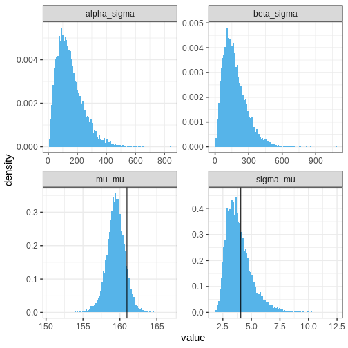

:::::::::::::::::::::::::::::::::::::: questions 

- How does Bayesian modeling accommodate group structure?


::::::::::::::::::::::::::::::::::::::::::::::::

::::::::::::::::::::::::::::::::::::: objectives

- Learn to construct and fit hierarchical models.

::::::::::::::::::::::::::::::::::::::::::::::::


**Hierarchical** (or multi-level) models are a class of models well-suited for situations where the study population comprises distinct but interconnected groups. For example, analyzing student performance across different schools, income disparities among various regions, or studying animal behavior within different populations are scenarios where such models can offer valuable insights.

Incorporating group-wise parameters allows us to model each group separately, and a model becomes hierarchical when we treat the parameters of the prior distribution as unknown. These parameters, known as hyperparameters, are assigned their own prior distribution, referred to as a hyperprior, and are learned during the model fitting process. Conceptually, these hyperparameters and hyperpriors operate at a higher level of hierarchy, hence the name.

For instance, let's consider the beta-binomial model discussed in Episode 1. It was employed to estimate the prevalence of left-handedness based on a sample of 50 students. If we were to include additional information, such as students' majors, we could extend the model as follows:

$$X_g \sim \text{Bin}(N_g, \theta_g) \\
\theta_g \sim \text{Beta}(\alpha, \beta) \\
\alpha, \beta \sim \Gamma(2, 0.1).$$


Here, the subscript $g$ indexes the groups based on majors. The group-specific prevalences for left-handedness $ \theta_g $ are assigned a beta prior with hyperparameters $ \alpha $ and $ \beta $ treated as random variables. The final line indicates the hyperprior $ \Gamma(2, 0.1) $ governing the prior beliefs about the hyperparameters.

In this hierarchical beta-binomial model, students are considered exchangeable within their majors but no longer across the entire population. However, an underlying assumption of similarity exists between the groups since they share a common prior. This is often referred to as partial pooling, where groups are not entirely independent but are not treated as equal either.

One of the key advantages of Bayesian hierarchical models is their capacity to leverage information across groups. By pooling information from various groups, these models can yield more robust estimates, particularly when data availability is limited.


Another distinction from non-hierarchical models is that the prior, or the **population distribution**, of the parameters is learned in the process. This population distribution can offer insights into parameter variability on a broader scale, even for groups where data is scarce or completely missing. For instance, if we had data on the handedness of students majoring in natural sciences, the population distribution could provide insights into students in humanities and social sciences as well.

In the following example, we will perform a hierarchical analysis of human heights across different countries.


## Example: human height 

Let's examine the heights of adults in various countries. In [1], averages and standard errors of adult heights in centimeters across different countries and age groups were provided. We'll utilize this dataset to generate a sample of hypothetical individual heights and then assess our ability to accurately reproduce these measured height statistics.

This approach is commonly employed in model testing: we generate simulated data with known parameters and subsequently compare the inferred results to these known parameters. In our case, the true parameters are derived from real-world data.

We'll employ a normal model with unknown mean $\mu$ and standard deviation $\sigma$ as our generative model, and treat these parameters hierarchically.

First, let's load the data and examine its structure.


```r
height <- read.csv("data/height_data.csv")
str(height)
```

```{.output}
'data.frame':	210000 obs. of  8 variables:
 $ Country                                   : chr  "Afghanistan" "Afghanistan" "Afghanistan" "Afghanistan" ...
 $ Sex                                       : chr  "Boys" "Boys" "Boys" "Boys" ...
 $ Year                                      : int  1985 1985 1985 1985 1985 1985 1985 1985 1985 1985 ...
 $ Age.group                                 : int  5 6 7 8 9 10 11 12 13 14 ...
 $ Mean.height                               : num  103 109 115 120 125 ...
 $ Mean.height.lower.95..uncertainty.interval: num  92.9 99.9 106.3 112.2 117.9 ...
 $ Mean.height.upper.95..uncertainty.interval: num  114 118 123 128 132 ...
 $ Mean.height.standard.error                : num  5.3 4.72 4.27 3.92 3.66 ...
```

Let's subset this data to simplify the analysis and focus on the height of adult women measured in 2019.


```r
height_women <- height %>% 
  filter(
    Age.group == 19, 
    Sex == "Girls",
    Year == 2019
    ) %>% 
  # Select variables of interest
  select(Country, Sex, Mean.height, Mean.height.standard.error)
```

Let's select 10 countries randomly


```r
# Select countries
N_countries <- 10
Countries <- sample(unique(height_women$Country),
                    size = N_countries,
                    replace = FALSE) %>% sort

height_women10 <- height_women %>% filter(Country %in% Countries)

height_women10
```

```{.output}
              Country   Sex Mean.height Mean.height.standard.error
1       Guinea Bissau Girls    158.7194                  1.1152409
2            Honduras Girls    155.1831                  0.8690683
3           Indonesia Girls    154.3552                  0.5208758
4          Kyrgyzstan Girls    160.2019                  0.8355103
5          Mozambique Girls    155.4210                  0.7713099
6         Netherlands Girls    170.3612                  1.0355356
7              Panama Girls    158.1865                  0.9293961
8  Russian Federation Girls    164.5174                  0.7749542
9              Serbia Girls    168.2851                  0.7831222
10           Viet Nam Girls    158.4257                  0.5720185
```


### Simulate data

Now, we can treat the values in the table above as ground truth and simulate some data based on them. Let's generate $N=15$ samples for each country from the normal model with $\mu = \text{Mean.height}$ and $\sigma = \text{Mean.height.standard.error}$.


```r
# Sample size per group 
N <- 15

# For each country, generate heights
height_sim <- lapply(1:N_countries, function(i) {
  
  my_df <- height_women10[i, ]
  
  data.frame(Country = my_df$Country, 
             # Random values from normal
             Height = rnorm(N,
                            mean = my_df$Mean.height,
                            sd = my_df$Mean.height.standard.error))

}) %>% 
  do.call(rbind, .)
```


Let's plot the data 

```r
# Plot
height_sim %>% 
    ggplot() +
    geom_point(aes(x = Height, y = Country)) + 
    labs(title = "Simulated data")
```


### Modeling

Let's build a normal model that uses partial pooling for the country means and standard deviations. The model can be stated as follows:

\begin{align}
X_{gi} &\sim \text{N}(\mu_g, \sigma_g) \\
\mu_g &\sim \text{N}(\mu_\mu, \sigma_\mu) \\
\sigma_g &\sim \Gamma(\alpha_\sigma, \beta_\sigma) \\
\mu_\mu &\sim \text{N}(0, 100)\\
\sigma_\mu &\sim \Gamma(2, 0.1) \\
\alpha_\sigma, \beta_\sigma  &\sim \Gamma(2, 0.01).
\end{align}

Above, $X_{gi}$ denotes the height for individual $i$ in country $g$. The country specific parameters $\mu_g$ and $\sigma_g$ are given normal and gamma priors, respectively, with unknown hyperparameters that, in turn, are given hyperpriors on the last two lines. 

Below is the Stan program for this model. The data points are input as a concatenated vector `X`. The country-specific start and end indices are computed in the transformed data block. This approach accommodates uneven sample sizes between groups, although in our data these are equal. 

The parameters block contains the declarations of mean and standard deviation vectors, along with the hyperparameters. The hyperparameter subscripts denote the parameter they are assigned to so, for instance, $\sigma_{\mu}$ is the standard deviation of the mean parameter $\mu$. The generated quantities block generates samples from the population distributions of $\mu$ and $\sigma$ and a posterior predictive distribution $\tilde{X}$.


```stan
data {
  int<lower=0> G; // number of groups
  int<lower=0> N[G]; // sample size within each group
  vector[sum(N)] X; // concatenated observations
}

transformed data {
  // get first and last index for each group in X
  int start_i[G];
  int end_i[G];
  
  for(g in 1:G) {
    
    if(g == 1) {
      start_i[1] = 1;
    } else {
      start_i[g] = start_i[g-1] + N[g-1];
    }
    
    end_i[g] = start_i[g] + N[g]-1;
  }
}

parameters {
  
  // parameters
  vector[G] mu;
  vector<lower=0>[G] sigma;
  
  // hyperparameters
  real mu_mu;
  real<lower=0> sigma_mu;
  real<lower=0> alpha_sigma;
  real<lower=0> beta_sigma;
}

model {
  
  // Likelihood for each group
  for(i in 1:G) {
    X[start_i[i]:end_i[i]] ~ normal(mu[i], sigma[i]);
  }
  
  // Priors
  mu ~ normal(mu_mu, sigma_mu);
  sigma ~ gamma(alpha_sigma, beta_sigma);
  
  // Hyperpriors
  mu_mu ~ normal(0, 100);
  sigma_mu ~ inv_gamma(2, 0.1);
  alpha_sigma ~ gamma(2, 0.01);
  beta_sigma ~ gamma(2, 0.01);
}

generated quantities {
  
  real mu_tilda;
  real<lower=0> sigma_tilda;
  real X_tilda; 
  
  // Population distributions
  mu_tilda = normal_rng(mu_mu, sigma_mu);
  sigma_tilda = gamma_rng(alpha_sigma, beta_sigma);
  
  // Posterior predictive distribution
  X_tilda = normal_rng(mu_tilda, sigma_tilda);
  
} 

```


Now we can call Stan and fit the model. Hierarchical models can encounter convergence issues and for this reason, we'll use 10000 iterations and set `adapt_delta = 0.99`. Moreover, we'll speed up the inference by running 2 chains in parallel by setting `cores = 2`. 


```r
stan_data <- list(G = length(unique(height_sim$Country)), 
                  N = rep(N, length(Countries)), 
                  X = height_sim$Height)

normal_hier_fit <- rstan::sampling(normal_hier_model,
                                   stan_data, 
                                   iter = 10000,
                                   chains = 2,
                                   # Use to avoid divergent transitions:
                                   control = list(adapt_delta = 0.99), 
                                   cores = 2,
                                   # Track progress every 5000 iterations
                                   refresh = 5000
                                   )
```


<!-- Non-pooled analysis -->


<!-- Fit -->


## Results

### Country-specific estimates

Let's first compare the marginal posteriors for the country-specific estimates: 


```r
par_summary <- rstan::summary(normal_hier_fit, c("mu", "sigma"))$summary %>% 
  data.frame() %>%
  rownames_to_column(var = "par") %>%
  separate(par, into = c("par", "country"), sep = "\\[") %>%
  mutate(country = gsub("\\]", "", country)) %>%
  mutate(country = Countries[as.integer(country)])
```


```r
# Plot

  ggplot() + 
  # geom_point(data = par_summary, aes(x = country, y = mean),
  #            color = posterior_color) +
  geom_errorbar(data = par_summary, aes(x = country, ymin = X2.5., ymax = X97.5.),
                color = posterior_color) + 
  geom_point(data = height_women10 %>% 
               rename_with(~ c('mu', 'sigma'), 3:4) %>% 
               gather(key = "par",
                      value = "value",
                      -c(Country, Sex)), 
             aes(x = Country, y = value)) + 
  geom_errorbar(data = unpooled_summaries, aes(x = country, ymin = X2.5., ymax = X97.5.),
                color = "brown") +
  facet_wrap(~ par, scales = "free", ncol = 1) +
  coord_flip() 
```



Above, the black points represent the true values, and the intervals are the 95% CIs for a hierarchical and non-hierarchical models, respectively. 


:::::::::::::::::::::::::::::: challenge

Experiment with the data and fit. Explore the effect of sample size, unequal sample sizes between countries, and the amount of countries, for example. 

::::::::::::::::::::::::::::::::::::::::


## Hyperparameters

Let's then plot the population distribution's parameters, that is, the hyperparameters. The sample-based values are included in the plots of $\mu_\mu$ and $\sigma_\mu$ (why not for the other two hyperparameters?). 


```r
## Population distributions:
population_samples_l <- rstan::extract(normal_hier_fit,
                                       c("mu_mu", "sigma_mu", "alpha_sigma", "beta_sigma")) %>% 
  do.call(cbind, .) %>% 
  set_colnames(c("mu_mu", "sigma_mu", "alpha_sigma", "beta_sigma")) %>% 
  data.frame() %>% 
  mutate(sample = 1:nrow(.)) %>% 
  gather(key = "hyperpar", value = "value", -sample)


ggplot() +
  geom_histogram(data = population_samples_l, 
                 aes(x = value, y = after_stat(density)),
                 fill = posterior_color,
                 bins = 100) + 
  geom_vline(data = height_women %>% 
               rename_with(~ c('mu', 'sigma'), 3:4) %>%
               filter(Sex == "Girls") %>% 
               summarise(mu_mu = mean(mu), sigma_mu = sd(mu)) %>% 
               gather(key = "hyperpar", value = "value"),
             aes(xintercept = value)
             )+
  facet_wrap(~hyperpar, scales = "free")
```


## Population distributions 

Let's then plot the population distributions and compare to the sample $\mu$'s and $\sigma$'s


```r
population_l <- rstan::extract(normal_hier_fit, c("mu_tilda", "sigma_tilda")) %>% 
  do.call(cbind, .) %>% 
  data.frame() %>% 
  set_colnames( c("mu", "sigma")) %>% 
  mutate(sample = 1:nrow(.)) %>% 
  gather(key = "par", value = "value", -sample)


 
ggplot() + 
  geom_histogram(data = population_l,
                 aes(x = value, y = after_stat(density)),
                 bins = 100, fill = posterior_color) +
    geom_histogram(data = height_women %>%
                     rename_with(~ c('mu', 'sigma'), 3:4) %>%
                     gather(key = "par", value = "value", -c(Country, Sex)) %>% 
                     filter(Sex == "Girls"), 
                   aes(x = value, y = after_stat(density)), 
                   alpha = 0.75, bins = 30) +
  facet_wrap(~par, scales = "free") + 
  labs(title = "Blue = posterior; black = sample")
```


We can see that the population distribution is able to capture the measured average heights and standard deviations relatively well. Remember that these estimates are based on a limited sample: 10 out of 200 countries with 15 individuals in each group. 

## Posterior predictive distribution

Finally, let's plot the posterior predictive distribution. Let's overlay it with the simulated data based on all countries.


```r
# For each country, generate some random girl's heights
Height_all <- lapply(1:nrow(height_women), function(i) {
  
  my_df <- height_women[i, ] %>% 
    rename_with(~ c('mu', 'sigma'), 3:4)
  
  data.frame(Country = my_df$Country, 
             Sex = my_df$Sex, 
             # Random normal values based on sample mu and sd
             Height = rnorm(N, my_df$mu, my_df$sigma))

}) %>% 
  do.call(rbind, .)
```


```r
# Extract the posterior predictive distribution
PPD <- rstan::extract(normal_hier_fit, c("X_tilda")) %>% 
  data.frame() %>% 
  set_colnames( c("X_tilda")) %>% 
  mutate(sample = 1:nrow(.))


ggplot() + 
  geom_histogram(data = PPD, 
                 aes(x = X_tilda, y = after_stat(density)),
                 bins = 100,
                 fill = posterior_color) +
  geom_histogram(data = Height_all, 
                 aes(x = Height, y = after_stat(density)), 
                 alpha = 0.75, 
                 bins = 100)
```


## Extensions

We analyzed women's heights in a few countries and modeled them hierarchically. You could make the structure richer in many ways, for instance by adding hierarchy between sexes, continents, developed/developing countries etc. 


::::::::::::::::::::::::::::::::::::: keypoints 

- Hierarchical models are appropriate for scenarios where the study population naturally divides into subgroups. 
- Hierarchical model borrow statistical strength across the groups. 
- Population distributions hold information about the variation of the model parameters in the whole population. 

::::::::::::::::::::::::::::::::::::::::::::::::

## Reading

- Bayesian Data Analysis (3rd ed.): Ch. 5
- Statistical Rethinking (2nd ed.): Ch. 13
- Bayes Rules!: Ch. 15-19


## References

[1] Height: Height and body-mass index trajectories of school-aged children and adolescents from 1985 to 2019 in 200 countries and territories: a pooled analysis of 2181 population-based studies with 65 million participants. Lancet 2020, 396:1511-1524
