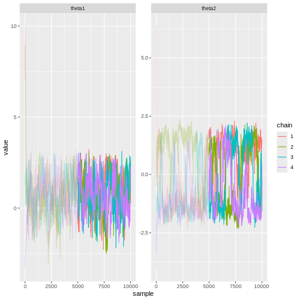

:::::::::::::::::::::::::::::::::::::: questions 

- What is MCMC?

::::::::::::::::::::::::::::::::::::::::::::::::

::::::::::::::::::::::::::::::::::::: objectives

- Idea behind MCMC

- Learn how to
  - assess convergence
  - implement MCMC


::::::::::::::::::::::::::::::::::::::::::::::::


Computing the posterior analytically poses an insurmountable challenge in the general case. Even if we were aware of the analytical form, marginalizing it to recover posteriors for the individual model parameters would still be difficult. In Episode 3, we saw that drawing conclusions about the inference could be achieved relatively easily by working on samples from the posterior distribution. However, obtaining such samples from the posterior distribution is a non-trivial task, unless the analytical posterior is known. In this episode, we will delve into Markov chain Monte Carlo methods (MCMC) that are the most extensively employed solution for generating these samples.

## Metropolis-Hastings algorithm

MCMC methods draw samples from the posterior distribution by constructing sequences (chains) of values in the parameter space that ultimately converge to the posterior. While there are other variants of MCMC, on this course we will mainly focus on the Metropolis-Hasting algorithm outlined below 

A chain starts at some initial value $\theta^{0}$, which can be random or based on some more informed criterion. The only precondition is that $p(\theta^{0} | X) > 0$. Then a transition distribution $T_i$ is used to generate a proposal for the subsequent value. An often-used solution is the normal distribution centered at the current value, $\theta^* \sim N(\theta^{i}, \sigma^2)$. This is where the term "Markov chain" comes from, each element is generated based on only the previous one. 

Next, the generated proposal $\theta^*$ is either accepted or rejected. If each proposal was accepted, the sequence would simply be a random walk in the parameter space and would not approximate the posterior to any degree. The rule that determines the acceptance should reflect this; proposals towards higher posterior densities should be favored over proposals toward low density areas. The solution is to compute the ratio

$$r = \frac{p(\theta^* | X) / T_i(\theta^* | \theta^{i})}{p(\theta^i | X) / T_i(\theta^{i} | \theta^{*})}.$$
In situations where the transition density is symmetric, such as with the normal distribution, $r$ reduces simply to the ratio of the posterior values.

The next element in the chain is then chosen: with probability $r$ the chain moves to the proposal, $\theta^{i+1} = \theta^*$ and with probability $1-r$ stays at the current value, $\theta^{i+1} = \theta^{i}.$ 

As the algorithm is ran long enough, convergence is guaranteed and eventually the samples will start approximating the posterior distribution. 


## Example: Banana distribution

Let's use the Metropolis-Hasting algorithm to generate samples from the posterior of the following statistical model: 

$$X \sim N(\theta_1 + \theta_2^2, 1) \\
\theta_1, \theta_2 \sim N(0, 1),$$

Data: 


```r
X <- c(3.78, 2.76, 2.84, 2.92, 1.3, 3.93, 3.69, 2.28, 2.81, 0.71)
```


Let's implement a Metropolis-Hastings sampler for the banana posterior. 


### Helper functions

Here, we'll write some functions that take care of the different steps of the MH-algorithm. 

The proposal distribution is the multivariate (2D) normal with diagonal covariance scaled by a scalar `jump_scale`. This choice amount to the random walk MH.


```r
# Proposal generator: multivariate Normal with covariance = jump_scale*diagonal
generate_proposal <- function(pars_now, jump_scale = 0.1) {
  
  my_n <- length(pars_now)
  
  mvtnorm::rmvnorm(1,
                   mean = pars_now,
                   sigma = jump_scale*diag(my_n))
}
```

This functions returns the log unnormalized posterior value at point `pars`.


```r
# Compute target distribution P(theta = pars).
get_log_target_value <- function(X, pars) {
  
  # log(likelihood)
  sum(
    dnorm(X,
          mean = pars[1] + pars[2]^2, 
          sd = 1,
          log = TRUE)
      ) +
    
    # log(prior)
    dnorm(pars[1], 0, 1, log = TRUE) +
    dnorm(pars[2], 0, 1, log = TRUE)
  
}
```


This function computes the ratio used to determine whether or not the proposal is accepted.


```r
# Compute ratio
get_ratio <- function(X, pars_now, pars_proposal) {
  
  # Proposal distribution is symmetric: 
  # N(theta_{i} | theta_{i+1}) = N(theta_{i+1} | theta_{i}),
  # so they cancel out!
  
  r <- exp(
    get_log_target_value(X, pars_proposal) - 
      get_log_target_value(X, pars_now)
    )
  
  return(r)
  
}
```


This function combines the helper functions above and loops over the chosen number of samples. 


```r
# Sampler
MH_sampler <- function(X,
                       inits,
                       n_samples = 1000,
                       jump_scale = 0.1) {

  
  # Matrix for samples
  pars <- matrix(nrow = n_samples, ncol = length(inits))
  
  # Set initial values
  pars[1, ] <- inits

  # Generate samples
  for(i in 2:n_samples) {
    
    # Current parameters
    pars_now <- pars[i-1, ]
    
    # Proposal
    pars_proposal <- generate_proposal(pars_now, jump_scale)
    
    # Ratio
    r <- get_ratio(X, pars_now, pars_proposal)
    
    r <- min(1, r)
    
    # Does the sampler move?
    move <- sample(x = c(TRUE, FALSE),
                   size = 1,
                   prob = c(r, 1-r))
    # OR: 
    # move <- runif(n = 1, min = 0, max = 1) <= r
    
    if(move) {
      pars[i, ] <- pars_proposal
    } else {
      pars[i, ] <- pars_now
    }
  
  
    }
  
  # Into data frame
  pars <- data.frame(pars)
  
  return(pars) 
  
}
```

### Run MH


We'll use 1000 samples with initial value (0, 5) and jump scale 0.01 and lay the sample trajectory over the true posterior density. 


```r
set.seed(12)
# Get samples
samples <- MH_sampler(X,
                      inits = c(0, 5),
                      n_samples = 1000, 
                      jump_scale = 0.01)

# Add column for sample index
samples$sample <- 1:nrow(samples)

# Plot joint posterior samples
p_MH1 <- p_grid +
  geom_path(data = samples,
            aes(x = X1, y = X2))
  

print(p_MH1)
```


*Conclusions: ---*


## Assessing convergence

Although converge is guaranteed in theory, it is not so in practice. 


Depending on random variations, these settings may cause the issues, including the following: 

1. Incomplete exploration of the target distribution. This means that the sampler visits only some of the areas with posterior mass. This can lead to a biased approximation. 

2. Slow convergence. Initial values of the chain are far from most of the posterior mass, leading to bias. 

3. A large proportion of the proposals is rejected, leading to inefficiency. 

4. Samples are autocorrelated, meaning that consequtive samples are close to each other. Ideally the samples would be totally independent. 


1. Monitoring convergence with statistics, such as effective sample size, $\hat{R}$, and divergent transitions (for Hamiltonian Monte Carlo). 

2. Looking at trace plots

3. Information about the model. E.g. if you use known the posterior to the multimodal.

4. Running time. If your sampler takes a long time, this *can* be a sign of an issue. 

5. Using Stan. Stan throws warnings automatically.

The issues can be remedied with: 

1. Running multiple long chains with distinct random initial values. 

2. Discarding an early proportion of the chain as warmup (burn-in). Stan uses 50% by default. 

3. Setting a good proposal distribution. This is easy said, but in practice not trivial at all. 


Like we saw above, unless the chains' initial values are in high posterior density areas, the early chain samples will bias the target distribution estimate. For this reason, it is customary to discard a proportion of the chain as "warmup." Often 50% is used and this is also the default in Stan. 


- Sample autocorrelation, effective sample size
  - ideally, the samples would be independent
- Mixing
- $\hat{R}$


Let's plot the generated trajectories and the true parameter value. Here, the initial 50% of the chains are colored dim to illustrate the fact that convergence to the posterior distribution requires long enough chains.


```r
samples <- samples %>% 
  mutate(warmup = c(rep("FALSE", nrow(samples)/2),
                    rep("TRUE", nrow(samples)/2)))

p_traj <- ggplot() +
  geom_path(data = samples,
            aes(x = mu, y = sigma, color = chain), alpha = 0.25) +
  # Post warmup samples
  geom_path(data = samples %>% filter(warmup == FALSE),
            aes(x = mu, y = sigma, color = chain)) +
  geom_point(aes(x = mu_true, y = sigma_true),
             size = 4) + 
  scale_color_grafify() +
  labs(title = "Red point = true value")

print(p_traj)
```

```{.error}
Error in `geom_path()`:
! Problem while computing aesthetics.
ℹ Error occurred in the 1st layer.
Caused by error:
! object 'mu' not found
```


Next, we'll make the trace plots, which are comprised of the chains of individual parameters. The warmup iterations are again colored dimmer. Trace plots can give quick visual information about the chains. When there are no converge issues, the trace plots should look like "hairy caterpillars," with sample of each chain located around the same value. In this case everything look ok. A standard convergence metric is the $\hat{R}$ which compares the variances between chains and to the variance within each chain. We'll omit the definition here but, generally, value $\hat{R} \geq 1.1$  are seen as a sign of convergence issues. However, with modern samplers such as Stan, thresholds closer to 1 are recommended (https://mc-stan.org/rstan/reference/Rhat.html).

Clearly convergence is reached fairly quickly after initialization, in some dozen iterations. Moreover, the chain autocorrelation low. This is desirable because it implies that the drawn samples are independent. Another popular convergence metric is the effective sample size. It quantifies the number of independent samples produced by the sampler.   


```r
# Long --> wide format
samples_w <- samples %>% 
  mutate(sample = rep(1:n_samples, 4)) %>%
  gather(key = "parameter", value = "value", -c(chain, warmup, sample))
```

```{.error}
Error in `mutate()` at tidyr/R/gather.R:84:3:
ℹ In argument: `sample = rep(1:n_samples, 4)`.
Caused by error:
! object 'n_samples' not found
```

```r
# Trace plot
p_trace <- ggplot() + 
  geom_line(data = samples_w,
            aes(x = sample, y = value, color = chain), alpha = 0.25) + 
  geom_line(data = samples_w %>% filter(warmup == FALSE),
            aes(x = sample, y = value, color = chain)) + 
  facet_wrap(chain ~ parameter,
             scales = "free",
             ncol = 2) + 
  scale_color_grafify()
```

```{.error}
Error in eval(expr, envir, enclos): object 'samples_w' not found
```

```r
print(p_trace)
```

```{.error}
Error in eval(expr, envir, enclos): object 'p_trace' not found
```


Let's compute the number of rejected proposals to get some idea about the efficiency of the algorithm. The less samples are rejected, the more efficient the sampler performs.  

```r
# Proportion of post-warmup samples where the proposal was rejected
sum(table(samples %>%
            filter(warmup == FALSE) %>%
            pull(mu))-1)/(n_chains*n_samples*(1-warmup))
```

```{.error}
Error in `pull()`:
Caused by error:
! object 'mu' not found
```


::::::::::::::::::::::::::::::::::::: challenge

Try different proposal distributions (e.g. 0.005, 0.5) standard deviations in the MCMC example above. How does this affect the inference and convergence? Why?

:::::::::::::::::::::::::::::::::::::::::::::::


# Example continued

Here we'll run 4 chains with 10000 samples each and discard the first 50% of each chain as warmup. The jump scale is 0.1. 


```r
# Generate more chains
n_chains <- 4

# More samples
n_samples <- 10000

# Consider first p% as warmup
warmup <- 0.5

samples <- lapply(1:n_chains, function(i) {
  
  # Use random initial values
  inits <- rnorm(2, 0, 5)
  
  chain <- MH_sampler(X, inits = inits,
                        n_samples = n_samples, 
                        jump_scale = 0.1)
  
  # Wrangle
  colnames(chain) <- c("theta1", "theta2")
  chain$sample <- 1:nrow(chain)
  chain$chain <- as.factor(i)
  chain[1:round(warmup*n_samples), "warmup"] <- TRUE
  chain[(round(warmup*n_samples)+1):n_samples, "warmup"] <- FALSE
  
  return(chain)
  
}) %>% 
  do.call(rbind, .)
```


```r
# Plot
p_joint_2 <- ggplot() +
  # warmup samples
  geom_path(data = samples %>%
              filter(warmup == TRUE),
            aes(theta1, theta2, color = chain),
            alpha = 0.25) +
  # post-warmup samples
  geom_path(data = samples %>%
              filter(warmup == FALSE),
            aes(theta1, theta2, color = chain))

print(p_joint_2)
```


Trace plots


```r
# Trace plots
p_trace_2 <- ggplot() + 
  geom_line(data = samples %>% 
              filter(warmup == TRUE) %>% 
              gather(key = "parameter",
                     value = "value",
                     -c("sample", "chain", "warmup")), 
            aes(x = sample, y = value, color = chain), 
            alpha = 0.25) + 
  geom_line(data = samples %>% 
              filter(warmup == FALSE) %>% 
              gather(key = "parameter",
                     value = "value",
                     -c("sample", "chain", "warmup")), 
            aes(x = sample, y = value, color = chain)) +
  facet_wrap(~parameter, ncol = n_chains, 
             scales = "free")


print(p_trace_2)
```




## Hamiltonian Monte Carlo

Hamiltonian Monte Carlo (HMC) is a variant of the Metropolis-Hastings algorithm implemented in Stan. The defining feature is the elaborate scheme it uses to generate proposals. Briefly, the idea is to simulate the dynamics of a particle moving in a potential landscape defined by the posterior. At each iteration, the particle is given a random momentum vector and then its dynamics are simulated forward for some time. The end of the trajectory is then taken as the proposal value. 

Compared to the random walk Metropolis-Hastings we implemented in this episode, HMC is very efficient. The main advantages of HMC is its ability to explore high-dimensional spaces more effectively, making it especially useful in complex models with many parameters

A type of convergence criterion exclusive to HMC are divergent transitions. In region of the parameter space where the posterior has high curvature, the simulated particle dynamics can produce spurious transitions which do not represent the posterior accurately. Such transitions are called divergent and signal that the particular area of parameter space is not explored accurately. Stan provides information about divergent transitions. 


::::::::::::::::::::::::::::::::::::: keypoints 

- MCMC is ....

- Convergence should be monitored
  - mixing: $\hat{R}$
  - divergent transitions

::::::::::::::::::::::::::::::::::::::::::::::::


## Reading

- See interactive visualization of different MCMC algorithms: https://chi-feng.github.io/mcmc-demo/app.html

- Statistical Rethinking
- BDA3
- Bayes Rules!


