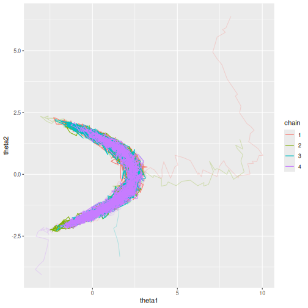
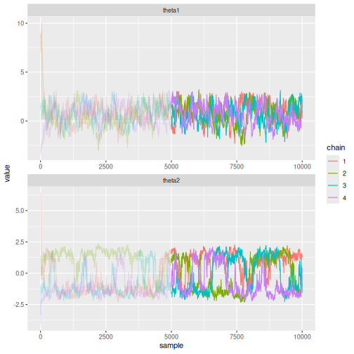

:::::::::::::::::::::::::::::::::::::: questions 

- How does Stan generate the posterior samples?

::::::::::::::::::::::::::::::::::::::::::::::::

::::::::::::::::::::::::::::::::::::: objectives

Learn:

- the basic idea of the Metropolis–Hastings algorithm;
- to assess the convergence of Markov chain Monte Carlo simulations;
- to implement a random-walk Metropolis–Hastings algorithm.

::::::::::::::::::::::::::::::::::::::::::::::::

The standard solution to fitting probabilistic models is to generate random samples from the posterior distribution. In the previous episode, we learned how to generate posterior samples using Stan without knowing how the samples are generated. In this episode, we'll study Markov chain Monte Carlo (MCMC) methods, a class of sampling algorithms used by Stan under the hood. 


## Metropolis-Hastings algorithm

MCMC methods draw samples from the posterior distribution by constructing sequences (chains) of values in the parameter space. If these algorithms are ran long enough, convergence to posterior (or to other specified target density) is guaranteed. This means that that if the chain is run long enough, the samples will eventually start approximating the posterior distribution. While there are many MCMC algorithms, we will mainly focus on the Metropolis-Hastings (MH) algorithm outlined below.

A chain is initialized at value $\theta^{0}$, which can be manually set or random. The only precondition is that the target distribution has positive mass at the location, $p(\theta^{0} | X) > 0$. Then, a candidate value $\theta^*$ for the next iteration is generated from a proposal distribution $T_i$. An often-used solution is the normal distribution centered at the current value, $\theta^* \sim N(\theta^{i}, \sigma^2)$. This is where the term "Markov chain" comes from, the value of each element depends only on the previous one. 

Next, the proposal $\theta^*$ is either accepted or rejected based on the following ratio:

$$r = \frac{p(\theta^* | X) / T_i(\theta^* | \theta^{i})}{p(\theta^i | X) / T_*(\theta^{i} | \theta^{*})}.$$
The proposal is accepted with probability $\min(r, 1)$, in which case the next element in the chain is $\theta^{i+1} = \theta^*$. If the proposal is not accepted the chain stays at the current value, $\theta^{i+1} = \theta^{i}.$ 

This approach induces directional randomness in the chain; proposals towards higher density areas are generally accepted but transitions away from it are also possible. In situations where the transition density is symmetric, such as with the normal distribution, $r$ reduces simply to the ratio of the posterior values, and all proposals toward higher posterior density areas are accepted. 


## Example: Banana distribution

Let's implement the MH algorithm in R and use it to generate posterior samples from the following statistical model: 

$$X \sim N(\theta_1 + \theta_2^2, 1) \\
\theta_1, \theta_2 \sim N(0, 1),$$

where $X$ is univariate data and $\theta_1, \theta_2$ the parameters. 

#### Helper functions

We begin by writing some helper functions that carry out the incremental steps of the MH algorithm. 

First, we need a proposal generator. Let's use the two-dimensional normal with identity covariance scaled by a scalar `jump_scale`.


``` r
set.seed(12)

generate_proposal <- function(pars_now, jump_scale = 0.1) {

  n_pars <- length(pars_now)
  
  # Random draw from multivariate normal
  theta_star <- mvtnorm::rmvnorm(1,
                                 mean = pars_now,
                                 sigma = jump_scale*diag(n_pars))
  return(theta_star)
}
```

Running MH also requires computing the (unnormalized) posterior density at the proposed parameter values. This function returns the log posterior value at the location `pars`. The density is computed on log scale to avoid issues with numerical precision. 


``` r
get_log_target_value <- function(X, pars) {
  
  # log(likelihood)
  sum(
    dnorm(X,
          mean = pars[1] + pars[2]^2, 
          sd = 1,
          log = TRUE)
      ) +
    
    # log(prior)
    dnorm(pars[1], 0, 1, log = TRUE) +
    dnorm(pars[2], 0, 1, log = TRUE)
  
}
```


Then, we'll write a function that computes the acceptance ratio $r$. Since the proposal is symmetric, the expression reduces to the ratio of the posterior densities of the proposed and current parameter values. Notice that a ratio on a log scale is equal to the difference of logarithms.


``` r
# Compute ratio
get_ratio <- function(X, pars_now, pars_proposal) {
  r <- exp(
    get_log_target_value(X, pars_proposal) - 
      get_log_target_value(X, pars_now)
    )
  
  return(r)
}
```


Finally, we can wrap the helpers in a function that loops over the algorithm iterations.  


``` r
MH_sampler <- function(X, # Data
                       inits, # Initial values
                       n_samples = 1000, # Number of iterations
                       jump_scale = 0.1 # Proposal jump variance
                       ) {

  # Matrix for samples
  pars <- matrix(nrow = n_samples, ncol = length(inits))
  
  # Set initial values
  pars[1, ] <- inits

  # Generate samples 
  for(i in 2:n_samples) {
    
    # Current parameters
    pars_now <- pars[i-1, ]
    
    # Proposal
    pars_proposal <- generate_proposal(pars_now, jump_scale)
    
    # Ratio
    r <- get_ratio(X, pars_now, pars_proposal)
    
    r <- min(1, r)
    
    # Accept proposal?
    move <- sample(x = c(TRUE, FALSE),
                   size = 1,
                   prob = c(r, 1-r))
    # OR: 
    # move <- runif(n = 1, min = 0, max = 1) <= r
    
    if(move) {
      pars[i, ] <- pars_proposal
    } else {
      pars[i, ] <- pars_now
    }
  }
  
  pars <- data.frame(pars)
  
  return(pars) 
}
```

#### Run MH

Now we can try out our MH implementation. Let's use the simulated data points stored in vector `X`:


``` r
X <- c(3.78, 2.76, 2.84, 2.92, 1.3, 3.93, 3.69, 2.28, 2.81, 0.71)
```

We'll generate 1000 samples with an initial value (0, 5) and jump scale 0.01. The trajectory of samples is plotted over the posterior density computed with the grid approximation.  


``` r
# Draw samples
samples1 <- MH_sampler(X,
                      inits = c(0, 5),
                      n_samples = 1000, 
                      jump_scale = 0.01)

colnames(samples1) <- c("theta1", "theta2")

# Add column for sample index
samples1$sample <- 1:nrow(samples1)


# Grid approximation
delta <- 0.05
df_grid <- expand.grid(seq(-4, 4, by = delta),
                       seq(-4, 5, by = delta)) %>%
  set_colnames(c("theta1", "theta2"))
```

``` error
Error in `set_colnames()`:
! could not find function "set_colnames"
```

``` r
for(i in 1:nrow(df_grid)) {
  df_grid[i, "likelihood"] <- prod(
    dnorm(X,
          df_grid[i, "theta1"] + df_grid[i, "theta2"]^2,
          1)
    )
}
```

``` error
Error:
! object 'df_grid' not found
```

``` r
df_grid <- df_grid %>% 
  mutate(prior = dnorm(theta1, 0, 1)*dnorm(theta2, 0, 1)) %>%
  mutate(posterior = prior*likelihood) %>% 
  mutate(posterior = posterior / (sum(posterior)*delta^2))
```

``` error
Error:
! object 'df_grid' not found
```

``` r
# Plot
p_grid <- ggplot() +
  geom_tile(data = df_grid, 
             aes(x = theta1, y = theta2, fill = posterior)) +
  scale_fill_gradientn(colours = rainbow(5))
```

``` error
Error:
! object 'df_grid' not found
```

``` r
# Plot joint posterior samples
p_MH1 <- p_grid +
  geom_path(data = samples1,
            aes(x = theta1, y = theta2))
```

``` error
Error:
! object 'p_grid' not found
```

``` r
print(p_MH1)
```

``` error
Error:
! object 'p_MH1' not found
```


Looking at the figure, a few observations are evident. Firstly, despite the chosen initial value being moderately far from the high-density areas of the posterior, the algorithm quickly converges to the target region. This rapid convergence is due to the fact that proposals toward higher density areas are favored. In fact, they are always accepted when the proposals are symmetric ($T_i(\theta^* | \theta^{i})=T_*(\theta^{i} | \theta^*)$)! However, it's important to note that such swift convergence is not guaranteed in all scenarios. In high dimensional cases (several model parameters), the probability of proposing a 'wrong' direction is high (see [curse of dimensionality](https://mc-stan.org/learn-stan/case-studies/curse-dims.html)).

Secondly, the samples before convergence introduce bias to the posterior approximation.

Finally, the posterior is not fully explored; no samples are generated from the lower mode in the figure. This highlights the fact that covergence doesn't guarantee a set of samples representative of the target.


::::::::::::::::::::::::::: challenge

Consider how you could address the two issues raised above:

1. Initial unconverged samples introduce a bias.
2. The sampler may not have explored the target distribution properly. 

Try different standard deviations for the proposal distributions in the  example above by changing the parameter `jump_scale`. How does this affect the inference and convergence? 

:::::::::::::::::::::::::::::::::::::


## Assessing convergence

Although convergence of MCMC is theoretically guaranteed, in practice, this is not always the case. Monitoring convergence is an important step in utilizing MCMC to ensure the reliability of recovered results. Depending on the used model, initial values, then amount of data, and other factors can cause convergence issues. Earlier, we mentioned two common complications, and here we will list a few more, along with actions that can alleviate the issues.

1. Slow convergence can occur when the proposals are not far enough from the current value, and the chain advances too slowly.

2. Incomplete exploration: there are insuffiecient amount samples from some significant areas.

3. A large proportion of the proposals is rejected when the proposal distribution is not appropriate for the target leading to inefficient sampling. 

4. Sample autocorrelation: Consecutive samples are close to each other. Ideally, we'd like to generate independent samples from the target. High sample autocorrelation can be caused by several factors, including the ones mentioned in the previous points.

These issues can be remedied with: 

1. Running multiple long chains with distinct random initial values. 

2. Discarding the early proportion of the chain as warm-up.

3. Setting an appropriate proposal distribution. 


There are statistics that have been developed to help monitor convergence, such as *effective sample size* and $\hat{R}$. Effective sample size estimates how many independent samples have been generated. Ideally, this number should be close to the total number of iterations the sampler has been run for. $\hat{R}$, on the other hand, measures chain mixing, that is, how well the chains agree with each other and is computed by comparing variances within each chain to the total variance across all samples. Usually, values of $\hat{R} > 1.1$ are considered as signaling convergence issues. The Stan development team [recommends](https://mc-stan.org/rstan/reference/Rhat.html) using 1.05 as the limit.

Besides statistics, visual evaluation of the samples can be useful. *Trace plots* refer to graphs where the marginal posterior samples are plotted against sample index. Trace plots can be used to investigate convergence and mixing properties, and can reveal, for example, multimodality. 

In Stan, many of the above-mentioned points have been automatized. By default, Stan runs 4 chains with 2000 iterations each, and discards the initial 50% as warm-up. Moreover, it computes $\hat{R}$, effective sample size, and other statistics and throws warnings in case of issues.

 


### Example continued

In light of the above information, let's re-fit the model of the previous example. Now, we'll run 4 chains with random initial values, 10000 samples each, and discard the first 50% of each chain as warm-up. We'll use 0.1 as the proposal variance.


``` r
# Number of chains
n_chains <- 4

# Number of samples
n_samples <- 10000

# Initial warmup proportion
warmup <- 0.5

samples2 <- lapply(1:n_chains, function(i) {
  
  # Use random initial values
  inits <- rnorm(2, 0, 5)
  
  chain <- MH_sampler(X, inits = inits,
                        n_samples = n_samples, 
                        jump_scale = 0.1)
  
  # Wrangle
  colnames(chain) <- c("theta1", "theta2")
  chain$sample <- 1:nrow(chain)
  chain$chain <- as.factor(i)
  chain[1:round(warmup*n_samples), "warmup"] <- TRUE
  chain[(round(warmup*n_samples)+1):n_samples, "warmup"] <- FALSE
  
  return(chain)
  
}) %>% 
  do.call(rbind, .)
```

Now it's evident that the sample trajectories explore the entire posterior distribution:


``` r
# Plot
p_joint_2 <- ggplot() +
  # Warm-up samples
  geom_path(data = samples2 %>%
              filter(warmup == TRUE),
            aes(theta1, theta2, color = chain),
            alpha = 0.25) +
  # Post-warm-up samples
  geom_path(data = samples2 %>%
              filter(warmup == FALSE),
            aes(theta1, theta2, color = chain))

print(p_joint_2)
```




Let's see what the trace plots look like. Generally, we'd want to see the samples randomly scattered around a mean value. For $\theta_1$ this is more or less the case, although there some autocorrelation is apparent. With $\theta_2$ we can see that the chains have mixed as they explore the same parameter ranges. However, the bimodality of the posterior is quite apparent. The $\hat{R}$ statistics are 1.0070384 and 1.1450652 for $\theta_1$ and $\theta_2$, respectively.


``` r
# Trace plots
p_trace_2 <- ggplot() + 
  geom_line(data = samples2 %>% 
              filter(warmup == TRUE) %>% 
              pivot_longer(cols = c(theta1, theta2), names_to = "parameter", values_to = "value"), 
            aes(x = sample, y = value, color = chain), 
            alpha = 0.25) + 
  geom_line(data = samples2 %>% 
              filter(warmup == FALSE) %>% 
              pivot_longer(cols = c(theta1, theta2), names_to = "parameter", values_to = "value"), 
            aes(x = sample, y = value, color = chain)) +
  facet_wrap(~parameter,
             ncol = 1,
             scales = "free")


print(p_trace_2)
```




## Hamiltonian Monte Carlo

Stan uses a variant of the Metropolis-Hastings algorithm called Hamiltonian Monte Carlo (HMC; or actually a variant HMC). The defining feature is the elaborate scheme it uses to generate proposals. Briefly, the idea is to simulate the dynamics of a particle moving in a potential landscape defined by the posterior. At each iteration, the particle is given a random momentum vector and then its dynamics are simulated forward for some time. The end of the trajectory is then taken as the proposal value. 

Compared to the random walk Metropolis-Hastings we implemented in this episode, HMC is very efficient. The main advantages of HMC is its ability to explore high-dimensional spaces more effectively, making it especially useful in complex models with many parameters.

A type of convergence criterion exclusive to HMC is the divergent transition. In a region of the parameter space where the posterior has high curvature, the simulated particle dynamics can produce spurious transitions which do not represent the posterior accurately. Such transitions are called divergent and signal that the particular area of parameter space is not explored accurately. Stan provides information about divergent transitions automatically.

::::::::::::::::::::::::::::::::::::: keypoints 

- Markov chain Monte Carlo methods can be used to generate samples from a posterior distribution.
- Values of the chain are generated from a proposal distribution.
- Proposals towards higher areas of the target distribution are accepted with higher probability. 
- MCMC convergence should always be monitored. 


::::::::::::::::::::::::::::::::::::::::::::::::


## Reading

- See interactive visualization of different MCMC algorithms: https://chi-feng.github.io/mcmc-demo/app.html

- Bayesian Data Analysis (3rd ed.): Ch. 11-12
- Statistical Rethinking (2nd ed.): Ch. 9
- Bayes Rules!: Ch. 6-7

