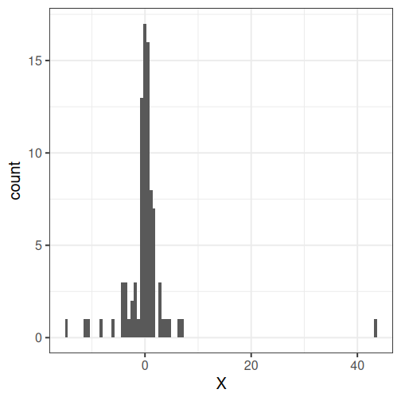
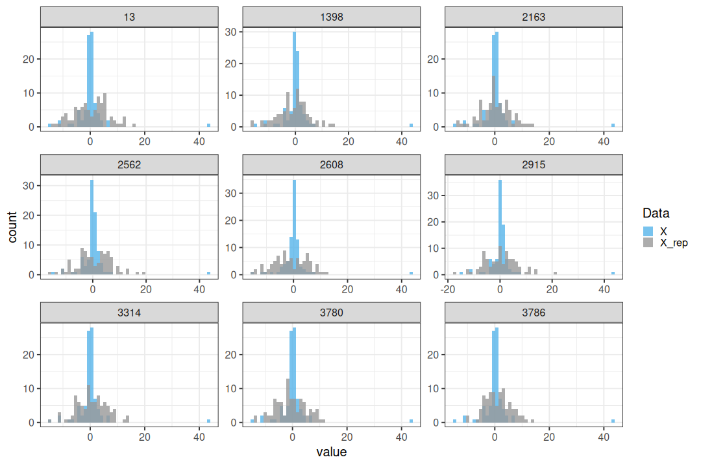
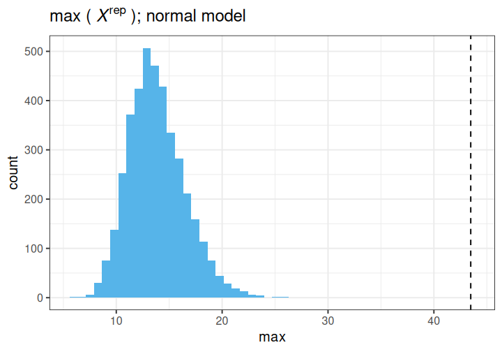
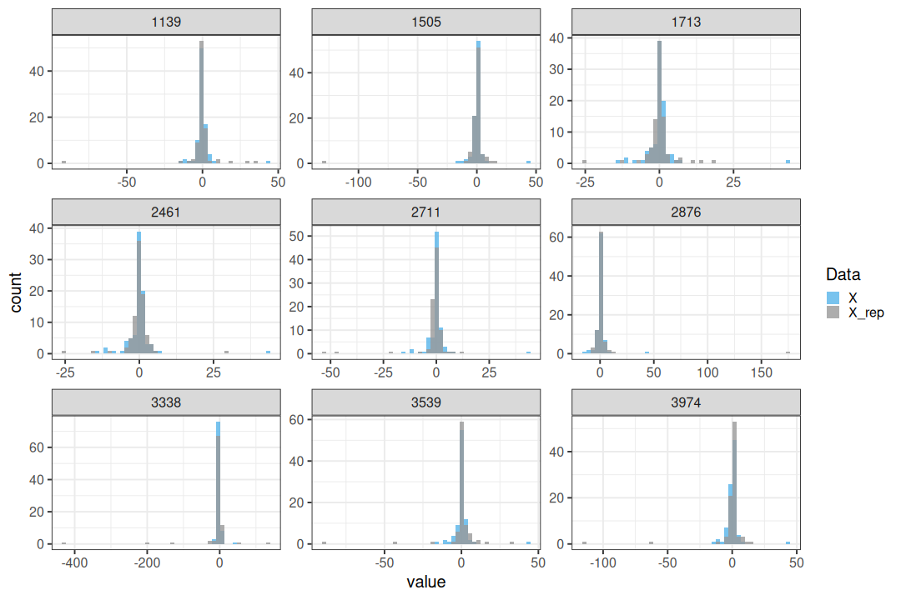
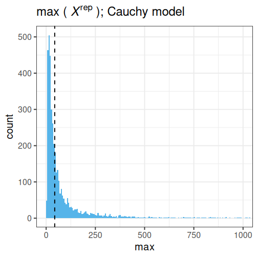

:::::::::::::::::::::::::::::::::::::: questions 

- How can competing models be compared?

::::::::::::::::::::::::::::::::::::::::::::::::

::::::::::::::::::::::::::::::::::::: objectives

Get a basic understanding of comparing models with

- posterior predictive check

- information criteria
  
- Bayesian cross-validation

::::::::::::::::::::::::::::::::::::::::::::::::

There is often uncertainty about which model would be the most appropriate choice a data being analysed. The aim of this episode is to introduce some tools that can be used to compare models systematically. We will explore three different approaches.

The first one is the posterior predictive check, which involves comparing a fitted model's predictions with the observed data. The second approach is to use information criteria, which measure the balance between model complexity and goodness-of-fit. The episode concludes with Bayesian cross-validation.

## Data

Throughout the chapter, we will use the same simulated data set in the examples, a set of $N=88$ univariate numerical data points. The data are available in the course's `data` folder as `df5.csv`.

Looking at the data histogram, it's evident that the data is approximately symmetrically distributed around 0. However, there is some dispersion in the data, and an extreme positive value, suggesting that the tails might be longer than those of a normal distribution. The Cauchy distribution is a potential alternative and below we will compare the suitability of these two distributions on this data. 





## Posterior predictive check

The idea of posterior predictive checking is to use the posterior predictive distribution to simulate a replicate data set and compare it to the observed data. The reasoning behind this approach is that if the model is a good fit, then replicate data should look similar the observed one. Qualitative discrepancies between the simulated and observed data can imply that the model does not match the properties of the data or the domain. 

The comparison can be done in different ways. Visual comparison is an option but a more rigorous approach is to compute the *posterior predictive p-value* ($p_B$), which measures how well the model can reproduce the observed data. Computing the $p_B$ requires specifying a statistic whose value is compared between the posterior predictions and the observations.

The steps of a posterior predictive check can be formulated in the following points: 

1. **Generate replicate data:**
  Use the posterior predictive distribution to simulate replicate datasets $X^{rep}$ with characteristics matching the observed data. In our example, this amounts to generating data with $N=88$ for each posterior sample. 
2. **Choose test quantity $T(X)$:**
  Choose an aspect of the data that you wish to check. We'll use the maximum value as the test quantity and compute it for the observed data and each replicate. It's important to note that not every imaginable data quantity will make a good $T(X)$, see chapter 6.3 in BDA3 for details. 
3. **Compute $p_B$:**
  The posterior predictive p-value is defined as the probability $Pr(T(X^{rep}) \geq T(X) | X)$, that is, the probability that the predictions produce test quantity values at least as extreme as those found in the data. Using samples, it is computed as the proportion of replicate data sets with $T$ not smaller than that of $T(X)$. The closer the $p_B$-value is to 1 (or 0), the larger the evidence that the model cannot properly emulate the data.  


Next we will perform these steps for the normal and Cauchy models. 

### Normal model

Below is a Stan program for the normal model that produces the replicate data in the generated quantities block. The values of `X_rep` are generated in a loop using the random number generator `normal_rng`. Notice that a single posterior sample $(\mu_s, \sigma_s)$ is used for each evaluation of the generated quantities block, resulting in a distribution of $X^{rep}$


``` stan
data {
  int<lower=0> N;
  vector[N] X;
}
parameters {
  real<lower=0> sigma;
  real mu;
}
model {
  X ~ normal(mu, sigma);
  
  mu ~ normal(0, 1);
  sigma ~ gamma(2, 1);
}

generated quantities {
  vector[N] X_rep;
  
  for(i in 1:N) {
    X_rep[i] = normal_rng(mu, sigma);
  }
}
```


Let's fit model and extract the replicates. 


``` r
# Fit
normal_fit <- normal_model$sample(data = list(N = N, X = df5$X), 
                       refresh = 0)

# Extract 
X_rep <- normal_fit$draws("X_rep") %>%
  posterior::as_draws_matrix() %>%
  data.frame() %>%
  mutate(sample = 1:nrow(.))
```


Below is a comparison of 9 realizations of $X^{rep}$ (blue) against the data (grey; the panel titles correspond to MCMC sample numbers). It is evident that the tail properties are different between  $X^{rep}$ and $X$, and this discrepancy indicates an issue with the model choice. 




Let's quantify this discrepancy by computing the $p_B$ using the maximum of the data as a test statistic. The maximum of the original data is max($X$) = 43.481. The posterior predictive $p$-value is $p_B =$ 0.

This means that the chosen statistic $T$ is at least as large as in the data in 100% of the replications, indicating strong evidence that the normal model is a poor choice for the data. 

The following histogram displays $T(X) = \max(X)$ (vertical line) against the distribution of $T(X^{rep})$.





### Cauchy model

Let's do an identical analysis using the Cauchy model.

The results are generated with code essentially copy-pasted from above, with a minor distinction in the Stan program.


``` stan
data {
  int<lower=0> N;
  vector[N] X;
}
parameters {
  // Scale
  real<lower=0> sigma;
  // location
  real mu;
}
model {
  // location = mu and scale = sigma
  X ~ cauchy(mu, sigma);
  
  mu ~ normal(0, 1);
  sigma ~ gamma(2, 1);
}
generated quantities {
  vector[N] X_rep;
  for(i in 1:N) {
    X_rep[i] = cauchy_rng(mu, sigma);
  }
}

```


A comparison of data $X$ and $X^{rep}$ from the Cauchy model shows good agreement between the posterior predictions and the data. The distributions appear to closely match around 0, and the replicates contain some extreme values similarly to the data.




The maximum value observed in the data is similar to those from replicate sets. Additionally, $p_B=$ 0, indicating no issues with the suitability of the model for the data.     distribution.




## Information criteria

Information criteria are statistics used for model comparison within both Bayesian and classical frequentist frameworks. These criteria provide a means to compare the relative suitability of a model to data by estimating out-of-sample predictive accuracy while simultaneously taking model complexity into account.

The Widely Applicable Information Criterion (WAIC) is an information criteria developed within the Bayesian framework. WAIC is computed using the log pointwise predictive density (lppd) of the data. Since the predictions are based on the model fit with the the data lppd is an overly confident estimate of the predictive capability. To take this into account, a penalization term $p_{WAIC}$ is included:

$$WAIC = -2(\text{lppd} - p_{WAIC}).$$
The log pointwise predictive density is computed as $\sum_{i=1}^N\log(\frac{1}{S}\sum_{s=1}^Sp(X_i | \theta^s)), $, where $X_i, \,i=1,\ldots,N$ are data points and $S$ the number of posterior samples. The penalization term $p_{WAIC} = \sum_{i=1}^N \text{Var}(\log p(y_i | \theta^s))$ measures the effective number of parameters (although this may not be apparent from the formula). Because the definition contains a negative of the difference $\text{lppd} - p_{WAIC}$, lower WAIC values imply a better fit. 


Let's use the WAIC to compare the normal and Cauchy models. First we'll need to fit both models on the data using the Stan programs utilized above. 


``` r
stan_data <- list(N = N, X = df5$X)

# Fit
normal_fit <- normal_model$sample(stan_data,
                       refresh = 0)
cauchy_fit <- cauchy_model$sample(stan_data, 
                       refresh = 0)

# Extract samples
normal_samples <- normal_fit$draws(c("mu", "sigma")) |>
  posterior::as_draws_matrix() |>
  as.data.frame() 
cauchy_samples <- cauchy_fit$draws(c("mu", "sigma")) |>
  posterior::as_draws_matrix() |>
  as.data.frame()
```


Then we will write a function for computing WAIC, but first a helper function to compute posterior predictive density for a single point.


``` r
get_ppd_point <- function(x, samples, model) {
  
  # Loop over posterior samples  
  pp_dens <- lapply(1:nrow(samples), function(S) {
    
    my_mu <- samples$mu[S]
    my_sigma <- samples$sigma[S]
    
    if(model == "normal") {
      # Normal(x | mu, sigma^2)
      dnorm(x = x,
            mean = my_mu,
            sd = my_sigma)
    } else if (model == "cauchy") {
      # Cauchy(x | location = mu, scale = sigma^2)
      dcauchy(x = x,
              location = my_mu,
              scale = my_sigma)
    }
    
  }) %>%
    unlist()
  
  return(pp_dens)
}

WAIC <- function(samples, data, model){
  
  # Loop over data points
  pp_dens <- lapply(1:length(data), function(i) {
    get_ppd_point(data[i], samples, model)
  }) %>%
    do.call(rbind, .)
  
  lppd <- apply(X = pp_dens,
                MARGIN = 1, 
                FUN = function(x) log(mean(x))) %>% 
    sum
  
  bias <- apply(X = pp_dens,
                MARGIN = 1, 
                FUN = function(x) var(log(x))) %>% 
    sum
  
  # WAIC
  waic = -2*(lppd - bias)
  
  return(waic)
}
```

Applying this function to the posterior samples, we'll obtain a lower value for the Cauchy model, implying a better fit to the data. This is in line with the posterior predictive check performed above. 


``` r
WAIC(normal_samples, df5$X, model = "normal")
```

``` output
[1] 581.6718
```

``` r
WAIC(cauchy_samples, df5$X, model = "cauchy")
```

``` output
[1] 413.6225
```


## Bayesian cross-validation

The final approach we take to model comparison in cross-validation. 

Cross-validation is a technique that estimates how well a model predicts previously unseen data by using fits of the model to a subset of the data to predict the rest of the data.

Performing cross-validation entails defining data partitioning for model training and testing. The larger the proportion of the data used for training, the better the accuracy. However, increasing the size of training data leads to having to fit the model more times. In the extreme case, when each data point is left out individually, the model is fit $N$ times. This is called leave-one-out cross-validation. 

To evaluate the predictive accuracy we will use log predictive density and take the sum over the different fits as the measure accuracy. This is then compared to the predictive densities of the data points based on the fit with all the data. This difference represents the effective number of parameters $p_{\text{loo-cv}}$ that can be used for comparing models.      
$$p_{\text{loo-cv}} = \text{lppd} - \text{lppd}_\text{loo-cv}.$$
Above, $\text{lppd}_\text{loo-cv}$  is the sum of the log predictive densities of data points evaluated based on 


Let's implement this in R.


``` r
# 1. Loop over leave-one-out data partitions for Normal Model
normal_loo_lpds <- lapply(1:N, function(i) {
  my_X <- df5$X[-i]
  my_x <- df5$X[i]
  
  my_normal_fit <- normal_model$sample(
    data = list(N = length(my_X), X = my_X),
    refresh = 0
  ) 
  
  my_samples <- my_normal_fit$draws(c("mu", "sigma")) |> 
    posterior::as_draws_df()
  
  my_lppd <- get_ppd_point(my_x, my_samples, "normal") |> 
    mean() |>  
    log()
  
  data.frame(i = i, lppd = my_lppd, model = "normal_loo")
}) |> 
  bind_rows()

# 2. Loop over leave-one-out data partitions for Cauchy Model
cauchy_loo_lpds <- lapply(1:N, function(i) {
  my_X <- df5$X[-i]
  my_x <- df5$X[i]
  
  my_cauchy_fit <- cauchy_model$sample(
    data = list(N = length(my_X), X = my_X),
    refresh = 0
  ) 
  
  my_samples <- my_cauchy_fit$draws(c("mu", "sigma")) |> 
    posterior::as_draws_df()
  
  my_lppd <- get_ppd_point(my_x, my_samples, "cauchy") |>  
    mean() |>  
    log()
  
  data.frame(i = i, lppd = my_lppd, model = "cauchy_loo")
}) |> 
  bind_rows()


# 3. Predictive density for data points using FULL data (Normal Model)
my_normal_full_fit <- normal_model$sample(
  data = list(N = nrow(df5), X = df5$X), 
  refresh = 0
)

normal_samples_full <- my_normal_full_fit$draws(c("mu", "sigma")) |> 
  posterior::as_draws_df()

normal_full_lpd <- lapply(1:N, function(i) {
  my_lppd <- get_ppd_point(df5$X[i], normal_samples_full, "normal") |> 
    mean() |>  
    log()
  data.frame(i = i, lppd = my_lppd, model = "normal")
}) |> 
  bind_rows()


# 4. Predictive density for data points using FULL data (Cauchy Model)
my_cauchy_full_fit <- cauchy_model$sample(
  data = list(N = nrow(df5), X = df5$X), 
  refresh = 0
)

cauchy_samples_full <- my_cauchy_full_fit$draws(c("mu", "sigma")) |> 
  posterior::as_draws_df()

cauchy_full_lpd <- lapply(1:N, function(i) {
  my_lppd <- get_ppd_point(df5$X[i], cauchy_samples_full, "cauchy") |> 
    mean() |>  
    log()
  data.frame(i = i, lppd = my_lppd, model = "cauchy")
}) |> 
  bind_rows()
```


Let's combine the computed log densities, and compute model-wise sums


``` r
# Combine
lppds <- bind_rows(normal_loo_lpds, 
                   normal_full_lpd, 
                   cauchy_loo_lpds, 
                   cauchy_full_lpd)

lppd_summary <- lppds %>% 
  group_by(model) %>% 
  summarize(lppd = sum(lppd), .groups = "drop")
```


Finally, we can compute the estimated of the effective number of parameters. As with WAIC, smaller values imply better suitability. In line with the posterior predictive check and WAIC, we see that, again, the Cauchy distribution gives a better description of the data that the normal model. 


``` r
# Effective number of parameters
normal_full_val <- lppd_summary %>% filter(model == "normal") %>% pull(lppd)
normal_loo_val  <- lppd_summary %>% filter(model == "normal_loo") %>% pull(lppd)
cauchy_full_val <- lppd_summary %>% filter(model == "cauchy") %>% pull(lppd)
cauchy_loo_val  <- lppd_summary %>% filter(model == "cauchy_loo") %>% pull(lppd)

# Calculate effective number of parameters
p_loo_cv_normal <- normal_full_val - normal_loo_val
p_loo_cv_cauchy <- cauchy_full_val - cauchy_loo_val

print(paste0("Effective number of parameters, normal = ", round(p_loo_cv_normal, 4)))
```

``` output
[1] "Effective number of parameters, normal = 32.5307"
```

``` r
print(paste0("Effective number of parameters, cauchy = ", round(p_loo_cv_cauchy, 4)))
```

``` output
[1] "Effective number of parameters, cauchy = 1.9341"
```


:::::::::::::::::::::::::::::::::::: callout
There are packages that enable computing WAIC and approximate leave-one-out score automatically so, in practice, there is seldom need to implement these yourself. In episode 7 you will learn about these options tools. 
::::::::::::::::::::::::::::::::::::::::::::


::::::::::::::::::::::::::::::::::::: keypoints 

- Bayesian model comparison can be performed (for example) with posterior predictive checks, information criteria, and cross-validation.

::::::::::::::::::::::::::::::::::::::::::::::::


## Reading

- Statistical Rethinking: Ch. 7
- BDA3: p.143: 6.3 Posterior predictive checking

- PSIS-loo
- https://mc-stan.org/loo/articles/online-only/faq.html

