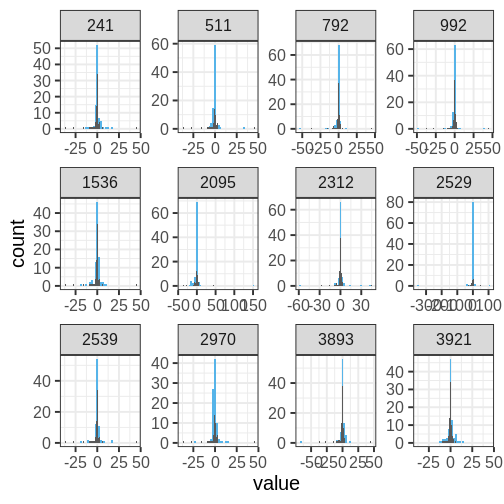

:::::::::::::::::::::::::::::::::::::: questions 

- What is model checking?

::::::::::::::::::::::::::::::::::::::::::::::::

::::::::::::::::::::::::::::::::::::: objectives

- Prior/Posterior predictive check
- Learn how assess model fit
  - Bayesian residuals?
  
- Model comparison with 
  - AIC, BIC, WAIC


::::::::::::::::::::::::::::::::::::::::::::::::

## Posterior predictive check

Gelman: "If the model fits, then replicated data generated under the model should look similar to observed data."

Idea: simulate data from the posterior predictive distribution and compare it to the observed data. Discrepancies between the simulated and observed data imply shortcomings in the model. 


# Data

Let's analyze the following data with the Normal model. 


# Normal model

Here we fit the normal model and generate posterior predictions $X_{rep}$. Notice, that this is slightly different from the posterior predictive distribution $\tilde{X}$. The former consists of replications of the original data, in this case 88 observations, the latter doesn't specify the sample size. 


```stan
data {
  int<lower=0> N;
  vector[N] X;
}

parameters {
  real<lower=0> sigma;
  real mu;
}

model {
  
  // Likelihood (vectorized)
  X ~ normal(mu, sigma);
  
  // Prior
  mu ~ normal(0, 1);
  sigma ~ gamma(2, 1);
  
}

generated quantities {
  vector[N] X_rep;

  // Posterior predictive density
  for(i in 1:N) {
    X_rep[i] = normal_rng(mu, sigma);
  }
  
}

```


```r
normal_fit <- sampling(normal_model,
                       list(N = N, X = df$X), 
                       refresh = 0)

# Extract samples
X_rep <- rstan::extract(normal_fit, "X_rep")[[1]] %>% data.frame() %>%
  mutate(sample = 1:nrow(.))
```


Below is a comparison of 12 samples of $\tilde{X}$ against the data (the panel titles correspond to MCMC sample numbers). The large discrepancy between the data and posterior predictions indicates that something is wrong with our model. It seems like the normal model misestimates the tails of the data, and that, likely, the normal model is a poor choice for such data in any case.

```r
# Subset
X_rep_sub <- X_rep %>% filter(sample %in%
                                    sample(X_rep$sample,
                                       12,
                                       replace = FALSE))

# Wide --> long
X_rep_sub_l <- X_rep_sub %>% gather(key = "key", value = "value", -sample)

p_hist <- ggplot() +
  geom_histogram(data = X_rep_sub_l,
                 aes(x = value
                     # y = after_stat(density)
                     ),
               bins = 40, fill = posterior_color) +
  facet_wrap(~sample, scales = "free") +
  geom_histogram(data = df,
                 aes(x = X
                     # y = after_stat(density)
                     ),
                 bins = 100)


print(p_hist)
```


Let's quantify the discrepancy using the maximum of the data as a test statistic. The maximum of the original data is max($X$) = 21.324. The following histogram shows this value (vertical line) against the maximum compute for each replicate data set $\tilde{X}$. 


```r
## Compute X_rep max
rep_maxs <- X_rep %>%
  select(-sample) %>%
  apply(MARGIN = 1, FUN = max) %>%
  data.frame(max = ., sample = 1:length(.))

ggplot() +
  geom_histogram(data = rep_maxs,
                 aes(x = max),
                 bins = 50, fill = posterior_color) +
  geom_vline(xintercept = max(df$X)) +
  labs(title = "Max value of the replicate data sets")
```


The proportion of replications $X_{rep}$ that produce at least as extreme values as the data is called the posterior predictive p-value ($ppp$). The $ppp$ quantifies the evidence for the suitability of the model for the data. In this case, the value is $ppp =$ 0.975 indicating that the model is, indeed, a poor choice for the data. 


# Cauchy model

Let's do a similar analysis utilizing the Cauchy model, which displays considerably longer tails. 

The code is essentially copy paste from above, with the distinction of the Stan program. 


```stan
data {
  int<lower=0> N;
  vector[N] X;
}

parameters {
  // Scale
  real<lower=0> sigma;
  // location
  real mu;
}

model {
  
  // Likelihood (vectorized)
  // location = mu and scale = sigma
  X ~ cauchy(mu, sigma);
  
  // Prior
  mu ~ normal(0, 1);
  sigma ~ gamma(2, 1);
  
}

generated quantities {
  vector[N] X_rep;
  for(i in 1:N) {
    X_rep[i] = cauchy_rng(mu, sigma);
  }
}

```


```r
cauchy_fit <- sampling(cauchy_model, list(N = N, X = df$X), 
                       refresh = 500)
```

```{.output}

SAMPLING FOR MODEL 'anon_model' NOW (CHAIN 1).
Chain 1: 
Chain 1: Gradient evaluation took 6e-06 seconds
Chain 1: 1000 transitions using 10 leapfrog steps per transition would take 0.06 seconds.
Chain 1: Adjust your expectations accordingly!
Chain 1: 
Chain 1: 
Chain 1: Iteration:    1 / 2000 [  0%]  (Warmup)
Chain 1: Iteration:  500 / 2000 [ 25%]  (Warmup)
Chain 1: Iteration: 1000 / 2000 [ 50%]  (Warmup)
Chain 1: Iteration: 1001 / 2000 [ 50%]  (Sampling)
Chain 1: Iteration: 1500 / 2000 [ 75%]  (Sampling)
Chain 1: Iteration: 2000 / 2000 [100%]  (Sampling)
Chain 1: 
Chain 1:  Elapsed Time: 0.017 seconds (Warm-up)
Chain 1:                0.018 seconds (Sampling)
Chain 1:                0.035 seconds (Total)
Chain 1: 

SAMPLING FOR MODEL 'anon_model' NOW (CHAIN 2).
Chain 2: 
Chain 2: Gradient evaluation took 3e-06 seconds
Chain 2: 1000 transitions using 10 leapfrog steps per transition would take 0.03 seconds.
Chain 2: Adjust your expectations accordingly!
Chain 2: 
Chain 2: 
Chain 2: Iteration:    1 / 2000 [  0%]  (Warmup)
Chain 2: Iteration:  500 / 2000 [ 25%]  (Warmup)
Chain 2: Iteration: 1000 / 2000 [ 50%]  (Warmup)
Chain 2: Iteration: 1001 / 2000 [ 50%]  (Sampling)
Chain 2: Iteration: 1500 / 2000 [ 75%]  (Sampling)
Chain 2: Iteration: 2000 / 2000 [100%]  (Sampling)
Chain 2: 
Chain 2:  Elapsed Time: 0.016 seconds (Warm-up)
Chain 2:                0.017 seconds (Sampling)
Chain 2:                0.033 seconds (Total)
Chain 2: 

SAMPLING FOR MODEL 'anon_model' NOW (CHAIN 3).
Chain 3: 
Chain 3: Gradient evaluation took 4e-06 seconds
Chain 3: 1000 transitions using 10 leapfrog steps per transition would take 0.04 seconds.
Chain 3: Adjust your expectations accordingly!
Chain 3: 
Chain 3: 
Chain 3: Iteration:    1 / 2000 [  0%]  (Warmup)
Chain 3: Iteration:  500 / 2000 [ 25%]  (Warmup)
Chain 3: Iteration: 1000 / 2000 [ 50%]  (Warmup)
Chain 3: Iteration: 1001 / 2000 [ 50%]  (Sampling)
Chain 3: Iteration: 1500 / 2000 [ 75%]  (Sampling)
Chain 3: Iteration: 2000 / 2000 [100%]  (Sampling)
Chain 3: 
Chain 3:  Elapsed Time: 0.016 seconds (Warm-up)
Chain 3:                0.015 seconds (Sampling)
Chain 3:                0.031 seconds (Total)
Chain 3: 

SAMPLING FOR MODEL 'anon_model' NOW (CHAIN 4).
Chain 4: 
Chain 4: Gradient evaluation took 3e-06 seconds
Chain 4: 1000 transitions using 10 leapfrog steps per transition would take 0.03 seconds.
Chain 4: Adjust your expectations accordingly!
Chain 4: 
Chain 4: 
Chain 4: Iteration:    1 / 2000 [  0%]  (Warmup)
Chain 4: Iteration:  500 / 2000 [ 25%]  (Warmup)
Chain 4: Iteration: 1000 / 2000 [ 50%]  (Warmup)
Chain 4: Iteration: 1001 / 2000 [ 50%]  (Sampling)
Chain 4: Iteration: 1500 / 2000 [ 75%]  (Sampling)
Chain 4: Iteration: 2000 / 2000 [100%]  (Sampling)
Chain 4: 
Chain 4:  Elapsed Time: 0.016 seconds (Warm-up)
Chain 4:                0.015 seconds (Sampling)
Chain 4:                0.031 seconds (Total)
Chain 4: 
```

```r
X_rep <- rstan::extract(cauchy_fit, "X_rep")[[1]] %>% data.frame() %>%
  mutate(sample = 1:nrow(.))

# Subset
X_rep_sub <- X_rep %>% filter(sample %in%
                                sample(X_rep$sample,
                                       12,
                                       replace = FALSE))

# Wide --> long
X_rep_sub_l <- X_rep_sub %>% gather(key = "key", value = "value", -sample)


ggplot() +
  geom_histogram(data = X_rep_sub_l,
                 aes(x = value
                     # y = after_stat(density)
                 ),
                 bins = 40, fill = posterior_color) +
  facet_wrap(~sample, scales = "free") +
  geom_histogram(data = df,
                 aes(x = X
                     # y = after_stat(density)
                 ),
                 bins = 100)
```


The figure below contains again the distribution of maximum value for each replicate set. The $ppp$ is large, indicating no issues with the suitability of the model on the data. 


```r
## Compute ppp
rep_maxs <- X_rep %>%
  select(-sample) %>%
  apply(MARGIN = 1, FUN = max) %>%
  data.frame(max = ., sample = 1:length(.))

ggplot() +
  geom_histogram(data = rep_maxs,
                 aes(x = max),
                 bins = 100000, fill = posterior_color) +
  geom_vline(xintercept = max(df$X)) +
  labs(title = paste0("ppp = ", mean(rep_maxs$max > max(df$X)))) +
  # set plot limits to aid with visualizations
  coord_cartesian(xlim = c(0, 1000)) 
```


::::::::::::::::::::::::::::::::::::: keypoints 

- point 1

::::::::::::::::::::::::::::::::::::::::::::::::


## Reading

- Statistical Rethinking: Ch. 7
- BDA3: p.143: 6.3 Posterior predictive checking
