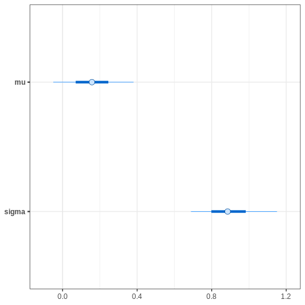
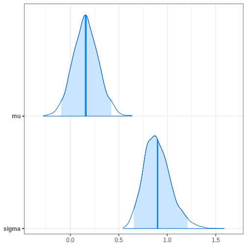
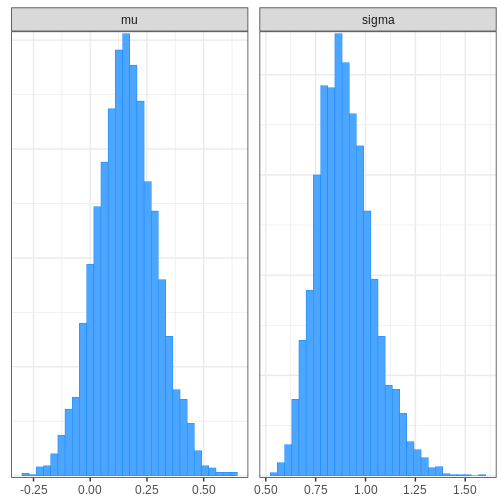
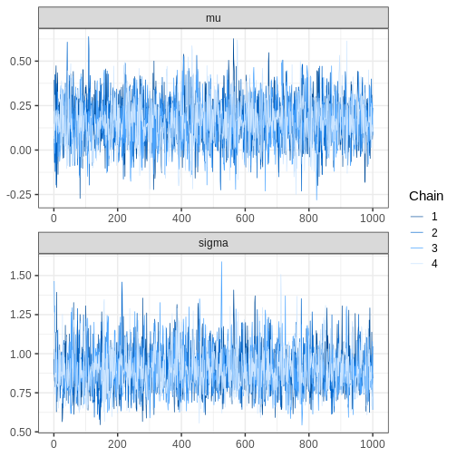
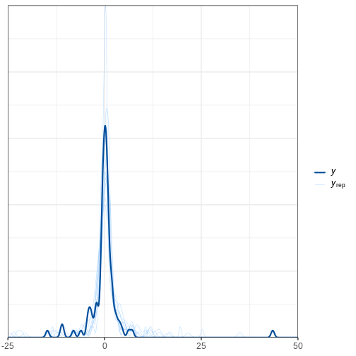
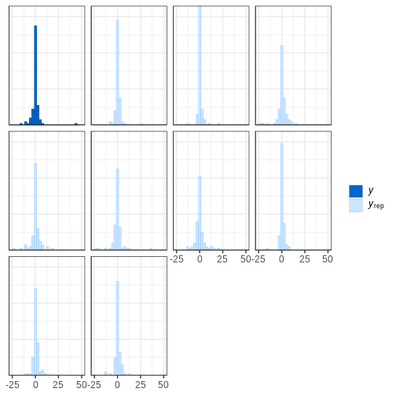
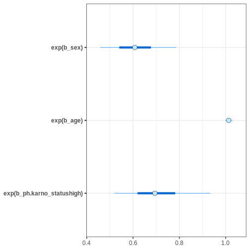
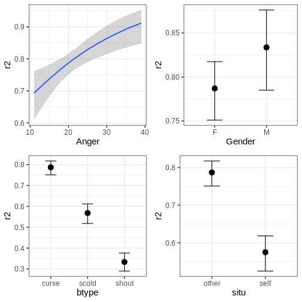
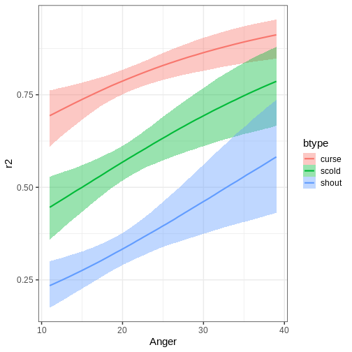

:::::::::::::::::::::::::::::::::::::: questions

- Which packages take advantage of Stan and how to use them?

::::::::::::::::::::::::::::::::::::::::::::::::

::::::::::::::::::::::::::::::::::::: objectives

- Learn to use Stan with additional R packages

::::::::::::::::::::::::::::::::::::::::::::::::


In this chapter, we will introduce packages that take advantage of Stan. The covered packages are  `loo`, which enables approximate Bayesian cross-validation,  `bayesplot`, which contains plotting tools, and `brms`, which allows calling Stan using common R syntax, without having to write the Stan code.


## `loo` 

The `loo` package allows computing approximate leave-one-out cross-validation (loo-cv) for models fitted with Stan. The approximation is based on something called Pareto smoothed importance sampling (PSIS) [1]. The package can also be used for computing WAIC and model weights for average predictive distributions.

### Example 1

We will demonstrate `loo` package usage on the model comparison example studied in Episode 5. We will fit the normal and Cauchy models on the same synthetic data, then use the tools provided in `loo` to compute and compare the approximate loo-cv scores for these two models. 

To be able to utilize the package functions, we need to add a log-likelihood computation in the Stan code, in the generated quantities block. The object containing the log-likelihood needs to be named `log_lik` so the 'loo' functions can find it. Below, we demonstrate this with the two models we are comparing.


``` stan
// Normal model
data {
  int<lower=0> N;
  vector[N] X;
}
parameters {
  real<lower=0> sigma;
  real mu;
}
model {
  X ~ normal(mu, sigma);
  
  mu ~ normal(0, 1);
  sigma ~ gamma(2, 1);
}

generated quantities {
  vector[N] X_rep;
  
  for(i in 1:N) {
    X_rep[i] = normal_rng(mu, sigma);
  }
  
  // Calculating log-likelihood for loo
  vector[N] log_lik;
  
  for (i in 1:N) {
  log_lik[i] = normal_lpdf(X[i] | mu, sigma);
  }
}
```


``` stan
// Cauchy model
data {
  int<lower=0> N;
  vector[N] X;
}
parameters {
  // Scale
  real<lower=0> sigma;
  // location
  real mu;
}
model {
  // location = mu and scale = sigma
  X ~ cauchy(mu, sigma);
  
  mu ~ normal(0, 1);
  sigma ~ gamma(2, 1);
}
generated quantities {
  vector[N] X_rep;
  for(i in 1:N) {
    X_rep[i] = cauchy_rng(mu, sigma);
  }
  
  // Calculating log-likelihood for loo
  vector[N] log_lik;
  
  for (i in 1:N) {
  log_lik[i] = cauchy_lpdf(X[i] | mu, sigma);
  }
}

```

Now we can fit the models in the usual way.


``` r
# Fit normal model
normal_fit <- rstan::sampling(normal_model_loo,
                       list(N = N, X = df5$X), 
                       refresh = 0, seed = 2024)
# Fit cauchy model
cauchy_fit <- rstan::sampling(cauchy_model_loo,
                       list(N = N, X = df5$X), 
                       refresh = 0, seed = 2024)
```

We can now compute PSIS-LOO for both of the models with `loo::loo` function. After the calling the function, information about the fit can be viewed by printing the `loo` objects.


``` r
# PSIS-LOO computation for normal model
normal_loo <- loo::loo(normal_fit)
```

``` warning
Warning: Some Pareto k diagnostic values are too high. See help('pareto-k-diagnostic') for details.
```

``` r
print(normal_loo)
```

``` output

Computed from 4000 by 88 log-likelihood matrix.

         Estimate   SE
elpd_loo   -288.8 41.6
p_loo        18.5 17.6
looic       577.7 83.3
------
MCSE of elpd_loo is NA.
MCSE and ESS estimates assume MCMC draws (r_eff in [0.8, 0.9]).

Pareto k diagnostic values:
                         Count Pct.    Min. ESS
(-Inf, 0.7]   (good)     87    98.9%   2167    
   (0.7, 1]   (bad)       0     0.0%   <NA>    
   (1, Inf)   (very bad)  1     1.1%   <NA>    
See help('pareto-k-diagnostic') for details.
```

``` r
# PSIS-LOO computation for cauchy model
cauchy_loo <- loo::loo(cauchy_fit)
print(cauchy_loo)
```

``` output

Computed from 4000 by 88 log-likelihood matrix.

         Estimate   SE
elpd_loo   -206.9 14.7
p_loo         2.0  0.0
looic       413.8 29.3
------
MCSE of elpd_loo is 0.0.
MCSE and ESS estimates assume MCMC draws (r_eff in [0.7, 0.8]).

All Pareto k estimates are good (k < 0.7).
See help('pareto-k-diagnostic') for details.
```

Running `print` returns $\widehat{\text{elpd}}_{\text{loo}}$ (expected log pointwise predictive density), $\hat{p}_{loo}$ (estimated number of parameters) and $\text{looic}$ (LOO information criterion) values and their standard errors. It also returns a table with the Pareto $k$ diagnostic values, which are used to asses the reliability of the estimates. Values below 1 are required for reliable PSIS estimates.

Model comparison can be done by using the `loo::loo_compare` function on the `loo` objects. The comparison is based on the models' elpd values. 


``` r
# Comparing models based on loo
loo::loo_compare(normal_loo, cauchy_loo)
```

``` output
       elpd_diff se_diff
model2   0.0       0.0  
model1 -81.9      36.2  
```

The comparison shows that the elpd difference is larger than the standard error, indicating that the cauchy model is expected to have better predictive performance than the normal model. This is in line with what we saw in chapter 5: the Cauchy distribution is a superior model for the data. 


::::::::::::::::::::::::::::::::::::::::: challenge

`loo` can also be used to compute WAIC for Bayesian models. Calculate WAIC for the two models and then compare them.

::::::::::::::::::::::::::::::: solution

First we need to extract the log-likelihood values from the fitted model object.


``` r
# Extracting loglik
normal_loglik <- loo::extract_log_lik(normal_fit)
cauchy_loglik <- loo::extract_log_lik(cauchy_fit)

# Computing WAIC for the models
normal_waic <- loo::waic(normal_loglik)
```

``` warning
Warning: 
1 (1.1%) p_waic estimates greater than 0.4. We recommend trying loo instead.
```

``` r
print(normal_waic)
```

``` output

Computed from 4000 by 88 log-likelihood matrix.

          Estimate   SE
elpd_waic   -290.0 42.8
p_waic        19.7 18.8
waic         580.1 85.6

1 (1.1%) p_waic estimates greater than 0.4. We recommend trying loo instead. 
```

``` r
cauchy_waic <- loo::waic(cauchy_loglik)
print(cauchy_waic)
```

``` output

Computed from 4000 by 88 log-likelihood matrix.

          Estimate   SE
elpd_waic   -206.9 14.7
p_waic         2.0  0.0
waic         413.8 29.3
```

Computing WAIC for the model return values for $\widehat{\text{eldp}}_{\text{WAIC}}$, $\hat{p}_{\text{WAIC}}$ and $\widehat{\text{WAIC}}$. Models can be compared based on WAIC using the same function as with PSIS-LOO.


``` r
# Comparing models based on WAIC
loo::loo_compare(normal_waic, cauchy_waic)
```

``` output
       elpd_diff se_diff
model2   0.0       0.0  
model1 -83.1      37.4  
```

::::::::::::::::::::::::::::::::::::::::

:::::::::::::::::::::::::::::::::::::::::::::::::::


## `bayesplot`

Next, we will look at the the `bayesplot` R package. The package provides a library of plotting functions for fitted Stan models. The created plots are `ggplot` objects, meaning that the plots can be customized with the functions from `ggplot2` package. The package enables plotting posterior draws, visual MCMC diagnostics and graphical posterior and prior predictive checking. The functions of the package also work with model fit with the popular packages `brms` and `rstanarm`.

### Example 1 continued

We will demonstrate using `bayesplot` with the Cauchy model used in the first example. First, we need to extract the posterior draws. Then, we will plot uncertainty intervals for $\mu$ and $\sigma$.


``` r
# Extracting draws
cauchy_draws <- as.array(cauchy_fit)

# Plotting uncertainty intervals
bayesplot::mcmc_intervals(cauchy_draws, pars = c("mu", "sigma"))
```



Alternatively, we can plot the (marginal) posterior sample histograms or densities with credible intervals as shaded areas as follows:


``` r
# Plotting estimated density curves
bayesplot::mcmc_areas(cauchy_draws, pars = c("mu", "sigma"),
                      prob = 0.95,
                      point_est = "mean")
```



``` r
# Plotting histogram
bayesplot::mcmc_hist(cauchy_draws, pars = c("mu", "sigma"))
```



`bayesplot` also provides functions for assessing MCMC convergence and visualizing fit diagnostics. For example, we can generate trace plots for the chains:


``` r
# Plotting trace plot
bayesplot::mcmc_trace(cauchy_draws, pars = c("mu", "sigma"),
                      facet_args = list(ncol = 1))
```




::::::::::::::::::::::::::::::::::::::::: challenge

Perform a graphical posterior predictive checks with `bayesplot`. Using the Cauchy model fit generated above, plot the density of $X_{rep}$ samples overlaid with the density of $X$. Alternatively, you can plot the corresponding histograms.

::::::::::::::::::::::::::::::: solution


``` r
# Extracting replicates and getting a subset
set.seed(2024)
X_rep <- rstan::extract(cauchy_fit, "X_rep")[[1]] %>%
  data.frame() %>%
    mutate(sample = 1:nrow(.))

N_rep <- 9

X_rep_sub <- X_rep %>% filter(sample %in%
                                sample(X_rep$sample,
                                       N_rep,
                                       replace = FALSE))
X_rep_sub <- X_rep_sub[, -89] %>%
  as.matrix()
```


``` r
# Plot density
# Limit x range for better illustration
bayesplot::ppc_dens_overlay(y = df5$X, yrep = X_rep_sub) + xlim(-25, 50)
```




``` r
# Plot histograms
bayesplot::ppc_hist(y = df5$X, yrep = X_rep_sub) + xlim(-25,50)
```




::::::::::::::::::::::::::::::::::::::::

:::::::::::::::::::::::::::::::::::::::::::::::::::


## `brms` R package

We will now introduce the `brms` R package. The package allows fitting probabilistic generalized (non-)linear models with Stan. A large range of distributions and link functions are supported, in addition to multilevel structure. Moreover, several built-in functions are available for priors. 

Models are specified using familiar R formula syntax, input into an R function which compiles and calls the Stan model in the backend.

The package also provides tools for evaluating the fit and MCMC convergence. These tools, in turn, use functions from the `loo` and `bayesplot` packages, that is, many of the same tools we covered earlier in this Episode. 

Next, we will demonstrate usage of the package with two different examples.


### Example 2: Survival modeling

In this example, we will demonstrate fitting a Cox proportional hazard model with `brms`. However, first, we will briefly describe and model and idea in survival modeling. 

The Cox model is a standard approach used in survival modeling, in which the outcome of interest is the time to some event. A common application is medical studies where patients are followed in time until an event (e.g. death) or until censoring. A subject is censored if the event doesn't occur during the follow-up. 

An important ingredient in survival modeling is the hazard function, representing the instantaneous risk for an event at time $t$, defined as  $\lambda(t)=\text{lim}_{h \to 0+} \frac{1}{h}P(t \le T<t+h|T\ge t)$. In the Cox model, the hazard function is of the form $\lambda(t_i,Z_i,\theta)=\lambda_0(t_i)\text{exp}(\beta^\prime Z_i)$.

The baseline hazard function $\lambda_0(t_i)$ represents the hazard when the covariates are set to their baselines, and is the same for each subject $i$. Commonly, the functional form the baseline hazard is not specified. The second part of the hazard function contains subject-specific covariates, $\text{exp}(\beta^\prime Z_i)$. 

The exponentials of the effects $\beta$ are called hazard ratios, which measure the hazard in one group against the hazard in another group.

When fitting the Cox model, `brms` uses M-splines for the baseline hazard. Splines are functions built from piecewise-defined polynomials. In other words, the baseline hazard is a combination of several different polynomial functions. M-splines are non-negative spline functions, which is important for reasons we omit. However, hopefully, the reader can appreciate the simplicity of the upcoming `brms` function call.


Before fitting the model, we will take a look at the `lung` dataset from the `survival` R package, which we will be analyzing below. The dataset consists of survival times of patients with advanced lung cancer including some clinical covariates. 


``` r
# Get data
lung <- survival::lung

# Take a peek
head(lung)
```

``` output
  inst time status age sex ph.ecog ph.karno pat.karno meal.cal wt.loss
1    3  306      2  74   1       1       90       100     1175      NA
2    3  455      2  68   1       0       90        90     1225      15
3    3 1010      1  56   1       0       90        90       NA      15
4    5  210      2  57   1       1       90        60     1150      11
5    1  883      2  60   1       0      100        90       NA       0
6   12 1022      1  74   1       1       50        80      513       0
```


The variable `status` denotes if an event (death) was observed or if the subject was censored. We will use three covariates: `age`, `sex` and `ph.karno`. The variable `ph.karno` describes how well a patient can perform daily activities rated by a physician. We will split the variable into two categories "high" and "low." 

Cox model can be fit with `brms::brm()` function by specifying `family = brmsfamily("cox")`. Censored data points are indicated with the `cens(1 - status)` argument. We will use a standard $\text{Normal}(0, 10)$ prior for the population-level effects, with the argument `prior(normal(0,10), class = b)`. The option `class = b` sets the prior for all population-level effects.
 

``` r
# Let's change status coding from 2/1 to 1/0
lung$status <- lung$status - 1

# Remove observations with NA ph.karno
lung <- lung[!is.na(lung$ph.karno),]

# Creating new variable for ph.karno status
lung$ph.karno_status <- cut(lung$ph.karno,
                            breaks = c(0, 70, 100),
                            labels = c("low", "high"))

# Fitting the model
fit_cox <- brms::brm(time | cens(1 - status) ~ sex + age + ph.karno_status,
             data = lung, family = brmsfamily("cox"), seed = 2024,
             silent = 2, refresh = 0, cores = 4,
             prior = prior(normal(0,10), class = b))
# Summary of the fit
summary(fit_cox)
```

``` output
 Family: cox 
  Links: mu = log 
Formula: time | cens(1 - status) ~ sex + age + ph.karno_status 
   Data: lung (Number of observations: 227) 
  Draws: 4 chains, each with iter = 2000; warmup = 1000; thin = 1;
         total post-warmup draws = 4000

Regression Coefficients:
                    Estimate Est.Error l-95% CI u-95% CI Rhat Bulk_ESS Tail_ESS
Intercept               1.27      0.68    -0.11     2.57 1.00     4304     2666
sex                    -0.50      0.16    -0.83    -0.19 1.00     4768     2842
age                     0.01      0.01    -0.01     0.03 1.00     4607     2784
ph.karno_statushigh    -0.36      0.18    -0.70    -0.02 1.00     4471     2616

Draws were sampled using sampling(NUTS). For each parameter, Bulk_ESS
and Tail_ESS are effective sample size measures, and Rhat is the potential
scale reduction factor on split chains (at convergence, Rhat = 1).
```

The summary output of the `brms` fit prints coefficient estimates, and also returns Rhat, Bulk_ESS and Tail_ESS values, which can be used to assess the convergence of the model. 

It is important to notice that the coefficients are the log hazard ratios, which means we still need to exponentiate them. The `bayesplot::mcmc_intervals()` function allows transforming the parameters before plotting with `transform = "exp"` argument.


``` r
# Get hazard values
sum_cox <- summary(fit_cox)
exp(sum_cox$fixed[,1:4])
```

``` output
                     Estimate Est.Error  l-95% CI   u-95% CI
Intercept           3.5576154  1.970680 0.8962140 13.1193479
sex                 0.6044998  1.179035 0.4369700  0.8279120
age                 1.0130229  1.009435 0.9945742  1.0318059
ph.karno_statushigh 0.6956990  1.193047 0.4959062  0.9847118
```

``` r
# Credible intervals
bayesplot::mcmc_intervals(fit_cox,
                          pars = c("b_sex", "b_age", "b_ph.karno_statushigh"),
                          transform = "exp")
```



Based on the estimates, it seems that age has only a minor effect on the hazard. Female sex and being "high" in `ph.karno` imply smaller hazards, meaning that these factors are protective. 

After fitting the model, we can print information about the priors used with the function `brms::get_prior`.


``` r
# Get priors for the cox model
brms::get_prior(fit_cox)
```

``` output
                  prior     class                coef group resp dpar nlpar lb
          normal(0, 10)         b                                             
          normal(0, 10)         b                 age                         
          normal(0, 10)         b ph.karno_statushigh                         
          normal(0, 10)         b                 sex                         
 student_t(3, 5.6, 2.5) Intercept                                             
           dirichlet(1)     sbhaz                                             
 ub       source
            user
    (vectorized)
    (vectorized)
    (vectorized)
         default
         default
```

The population-level effects have the normal prior we specified. In `brms`, the default prior for the intercept is Student's t-distribution with three degrees of freedom. The Stan program `brms` ran under the hood can be printed with the `brms::stancode` function.


``` r
# Print the Stan code
brms::stancode(fit_cox)
```

``` output
// generated with brms 2.22.0
functions {
  /* distribution functions of the Cox proportional hazards model
   * parameterize hazard(t) = baseline(t) * mu
   * so that higher values of 'mu' imply lower survival times
   * Args:
   *   y: the response value; currently ignored as the relevant
   *     information is passed via 'bhaz' and 'cbhaz'
   *   mu: positive location parameter
   *   bhaz: baseline hazard
   *   cbhaz: cumulative baseline hazard
   */
  real cox_lhaz(real y, real mu, real bhaz, real cbhaz) {
    return log(bhaz) + log(mu);
  }
  vector cox_lhaz(vector y, vector mu, vector bhaz, vector cbhaz) {
    return log(bhaz) + log(mu);
  }

  // equivalent to the log survival function
  real cox_lccdf(real y, real mu, real bhaz, real cbhaz) {
    return - cbhaz * mu;
  }
  real cox_lccdf(vector y, vector mu, vector bhaz, vector cbhaz) {
    return - dot_product(cbhaz, mu);
  }

  real cox_lcdf(real y, real mu, real bhaz, real cbhaz) {
    return log1m_exp(cox_lccdf(y | mu, bhaz, cbhaz));
  }
  real cox_lcdf(vector y, vector mu, vector bhaz, vector cbhaz) {
    return sum(log1m_exp(- cbhaz .* mu));
  }

  real cox_lpdf(real y, real mu, real bhaz, real cbhaz) {
    return cox_lhaz(y, mu, bhaz, cbhaz) + cox_lccdf(y | mu, bhaz, cbhaz);
  }
  real cox_lpdf(vector y, vector mu, vector bhaz, vector cbhaz) {
    return sum(cox_lhaz(y, mu, bhaz, cbhaz)) + cox_lccdf(y | mu, bhaz, cbhaz);
  }

  // Distribution functions of the Cox model in log parameterization
  real cox_log_lhaz(real y, real log_mu, real bhaz, real cbhaz) {
    return log(bhaz) + log_mu;
  }
  vector cox_log_lhaz(vector y, vector log_mu, vector bhaz, vector cbhaz) {
    return log(bhaz) + log_mu;
  }

  real cox_log_lccdf(real y, real log_mu, real bhaz, real cbhaz) {
    return - cbhaz * exp(log_mu);
  }
  real cox_log_lccdf(vector y, vector log_mu, vector bhaz, vector cbhaz) {
    return - dot_product(cbhaz, exp(log_mu));
  }

  real cox_log_lcdf(real y, real log_mu, real bhaz, real cbhaz) {
    return log1m_exp(cox_log_lccdf(y | log_mu, bhaz, cbhaz));
  }
  real cox_log_lcdf(vector y, vector log_mu, vector bhaz, vector cbhaz) {
    return sum(log1m_exp(- cbhaz .* exp(log_mu)));
  }

  real cox_log_lpdf(real y, real log_mu, real bhaz, real cbhaz) {
    return cox_log_lhaz(y, log_mu, bhaz, cbhaz) +
           cox_log_lccdf(y | log_mu, bhaz, cbhaz);
  }
  real cox_log_lpdf(vector y, vector log_mu, vector bhaz, vector cbhaz) {
    return sum(cox_log_lhaz(y, log_mu, bhaz, cbhaz)) +
           cox_log_lccdf(y | log_mu, bhaz, cbhaz);
  }
}
data {
  int<lower=1> N;  // total number of observations
  vector[N] Y;  // response variable
  // censoring indicator: 0 = event, 1 = right, -1 = left, 2 = interval censored
  array[N] int<lower=-1,upper=2> cens;
  int<lower=1> K;  // number of population-level effects
  matrix[N, K] X;  // population-level design matrix
  int<lower=1> Kc;  // number of population-level effects after centering
  // data for flexible baseline functions
  int Kbhaz;  // number of basis functions
  // design matrix of the baseline function
  matrix[N, Kbhaz] Zbhaz;
  // design matrix of the cumulative baseline function
  matrix[N, Kbhaz] Zcbhaz;
  // a-priori concentration vector of baseline coefficients
  vector<lower=0>[Kbhaz] con_sbhaz;
  int prior_only;  // should the likelihood be ignored?
}
transformed data {
  // indices of censored data
  int Nevent = 0;
  int Nrcens = 0;
  int Nlcens = 0;
  array[N] int Jevent;
  array[N] int Jrcens;
  array[N] int Jlcens;
  matrix[N, Kc] Xc;  // centered version of X without an intercept
  vector[Kc] means_X;  // column means of X before centering
  // collect indices of censored data
  for (n in 1:N) {
    if (cens[n] == 0) {
      Nevent += 1;
      Jevent[Nevent] = n;
    } else if (cens[n] == 1) {
      Nrcens += 1;
      Jrcens[Nrcens] = n;
    } else if (cens[n] == -1) {
      Nlcens += 1;
      Jlcens[Nlcens] = n;
    }
  }
  for (i in 2:K) {
    means_X[i - 1] = mean(X[, i]);
    Xc[, i - 1] = X[, i] - means_X[i - 1];
  }
}
parameters {
  vector[Kc] b;  // regression coefficients
  real Intercept;  // temporary intercept for centered predictors
  // baseline hazard coefficients
  simplex[Kbhaz] sbhaz;
}
transformed parameters {
  real lprior = 0;  // prior contributions to the log posterior
  lprior += normal_lpdf(b | 0, 10);
  lprior += student_t_lpdf(Intercept | 3, 5.6, 2.5);
  lprior += dirichlet_lpdf(sbhaz | con_sbhaz);
}
model {
  // likelihood including constants
  if (!prior_only) {
    // compute values of baseline function
    vector[N] bhaz = Zbhaz * sbhaz;
    // compute values of cumulative baseline function
    vector[N] cbhaz = Zcbhaz * sbhaz;
    // initialize linear predictor term
    vector[N] mu = rep_vector(0.0, N);
    mu += Intercept + Xc * b;
    // vectorized log-likelihood contributions of censored data
    target += cox_log_lpdf(Y[Jevent[1:Nevent]] | mu[Jevent[1:Nevent]], bhaz[Jevent[1:Nevent]], cbhaz[Jevent[1:Nevent]]);
    target += cox_log_lccdf(Y[Jrcens[1:Nrcens]] | mu[Jrcens[1:Nrcens]], bhaz[Jrcens[1:Nrcens]], cbhaz[Jrcens[1:Nrcens]]);
    target += cox_log_lcdf(Y[Jlcens[1:Nlcens]] | mu[Jlcens[1:Nlcens]], bhaz[Jlcens[1:Nlcens]], cbhaz[Jlcens[1:Nlcens]]);
  }
  // priors including constants
  target += lprior;
}
generated quantities {
  // actual population-level intercept
  real b_Intercept = Intercept - dot_product(means_X, b);
}
```


### Example 3: Hierarchical binomial model

We will now demonstrate one of the key focuses of `brms`, fitting hierarchical models. The syntax for specifying hierarchical models is similar as in the `lme4` package, which is used to fit frequentist multilevel models in R. 

For this example, we will be using is the `VerbAgg` data from `lme4` package. The data consist of item responses to a questionnaire on verbal aggression. 


``` r
# Get data
VerbAgg <- lme4::VerbAgg

head(VerbAgg)
```

``` output
  Anger Gender        item    resp id btype  situ mode r2
1    20      M S1WantCurse      no  1 curse other want  N
2    11      M S1WantCurse      no  2 curse other want  N
3    17      F S1WantCurse perhaps  3 curse other want  Y
4    21      F S1WantCurse perhaps  4 curse other want  Y
5    17      F S1WantCurse perhaps  5 curse other want  Y
6    21      F S1WantCurse     yes  6 curse other want  Y
```

We will estimate population-level effects for Anger, Gender, btype and situ, and includea group-level intercept for id. The variable of interest is the binary r2, which contains the response to an question in the questionnaire. We will use $\text{Normal}(0, 10)$ as the prior for all the population-level effects. For the standard deviation of group-level effect we will set a (half-)$\text{Cauchy}(0, 5)$ prior. By default, `brms` uses half-Student's t-distribution with three degrees of freedom for standard deviation parameters. The group-level intercept for variable id is specified with the argument `(1|id)`. Let's now fit the model.


``` r
# Change coding for r2
VerbAgg <- VerbAgg %>%
  mutate(r2 = ifelse(r2 == "N", 0, 1))
# Fit model
fit_hier <- brms::brm(r2 ~ Anger + Gender + btype + situ + (1|id),
                      family = bernoulli, 
                      data = VerbAgg,
                      seed = 2024, cores = 4, silent = 2, refresh = 0,
                      prior = prior(normal(0, 10), class = b) + 
                        prior(cauchy(0,5), class = sd))
# Summary
summary(fit_hier)
```

``` output
 Family: bernoulli 
  Links: mu = logit 
Formula: r2 ~ Anger + Gender + btype + situ + (1 | id) 
   Data: VerbAgg (Number of observations: 7584) 
  Draws: 4 chains, each with iter = 2000; warmup = 1000; thin = 1;
         total post-warmup draws = 4000

Multilevel Hyperparameters:
~id (Number of levels: 316) 
              Estimate Est.Error l-95% CI u-95% CI Rhat Bulk_ESS Tail_ESS
sd(Intercept)     1.30      0.07     1.17     1.43 1.00     1086     1687

Regression Coefficients:
           Estimate Est.Error l-95% CI u-95% CI Rhat Bulk_ESS Tail_ESS
Intercept      0.21      0.34    -0.49     0.87 1.01      637     1035
Anger          0.05      0.02     0.02     0.09 1.01      664     1026
GenderM        0.31      0.19    -0.05     0.68 1.00      580     1257
btypescold    -1.03      0.07    -1.17    -0.90 1.00     4963     3254
btypeshout    -2.00      0.07    -2.14    -1.85 1.00     4867     3286
situself      -1.01      0.06    -1.12    -0.89 1.00     5877     3022

Draws were sampled using sampling(NUTS). For each parameter, Bulk_ESS
and Tail_ESS are effective sample size measures, and Rhat is the potential
scale reduction factor on split chains (at convergence, Rhat = 1).
```

The conditional effects of the predictors can easily be plotted with the function `brms::conditional_effects`.


``` r
# Conditional effects
plots <- plot(conditional_effects(fit_hier), plot = FALSE)
cowplot::plot_grid(plots[[1]], plots[[2]], plots[[3]], plots[[4]])
```



The function can also plot variable interactions. Let's plot the conditional effect for interaction between Anger and btype.


``` r
# Plot conditional effect for interaction of Anger and btype
plot(conditional_effects(fit_hier, effects = "Anger:btype"))
```




Let us now do a slight alteration in model and add another group-level intercept for the item variable. The priors are same as in the first model. The `update` function can be used to modify the formula without writing it anew in its entirety.


``` r
# Update model
fit_hier2 <- update(fit_hier, formula. = ~ . + (1|item), newdata = VerbAgg, seed = 2024,
                    cores = 4, silent = 2, refresh = 0)
# Summary
summary(fit_hier2)
```

``` output
 Family: bernoulli 
  Links: mu = logit 
Formula: r2 ~ Anger + Gender + btype + situ + (1 | id) + (1 | item) 
   Data: VerbAgg (Number of observations: 7584) 
  Draws: 4 chains, each with iter = 2000; warmup = 1000; thin = 1;
         total post-warmup draws = 4000

Multilevel Hyperparameters:
~id (Number of levels: 316) 
              Estimate Est.Error l-95% CI u-95% CI Rhat Bulk_ESS Tail_ESS
sd(Intercept)     1.36      0.07     1.23     1.51 1.00     1347     1922

~item (Number of levels: 24) 
              Estimate Est.Error l-95% CI u-95% CI Rhat Bulk_ESS Tail_ESS
sd(Intercept)     0.59      0.11     0.42     0.84 1.00     1404     2252

Regression Coefficients:
           Estimate Est.Error l-95% CI u-95% CI Rhat Bulk_ESS Tail_ESS
Intercept      0.18      0.44    -0.65     1.05 1.01      831     1522
Anger          0.06      0.02     0.02     0.09 1.00      801     1568
GenderM        0.32      0.20    -0.07     0.72 1.00      847     1333
btypescold    -1.06      0.30    -1.63    -0.43 1.00     1191     1561
btypeshout    -2.11      0.30    -2.71    -1.52 1.00     1284     1889
situself      -1.05      0.25    -1.54    -0.55 1.00     1156     1828

Draws were sampled using sampling(NUTS). For each parameter, Bulk_ESS
and Tail_ESS are effective sample size measures, and Rhat is the potential
scale reduction factor on split chains (at convergence, Rhat = 1).
```

Another useful aspect of `update` is that it allows resampling from the model without having to recompile the model, for example, using different number of iterations. However, changes to the model itself require recompilation.

To end this section, let's compare the two models by using `brms::loo()`. This works in the same way as the `loo::loo_compare`.


``` r
# Compare models
brms::loo(fit_hier, fit_hier2)
```

``` output
Output of model 'fit_hier':

Computed from 4000 by 7584 log-likelihood matrix.

         Estimate   SE
elpd_loo  -4004.9 42.9
p_loo       268.0  3.7
looic      8009.7 85.8
------
MCSE of elpd_loo is 0.2.
MCSE and ESS estimates assume MCMC draws (r_eff in [1.1, 2.2]).

All Pareto k estimates are good (k < 0.7).
See help('pareto-k-diagnostic') for details.

Output of model 'fit_hier2':

Computed from 4000 by 7584 log-likelihood matrix.

         Estimate   SE
elpd_loo  -3866.9 43.9
p_loo       287.0  4.1
looic      7733.8 87.8
------
MCSE of elpd_loo is 0.2.
MCSE and ESS estimates assume MCMC draws (r_eff in [1.1, 2.6]).

All Pareto k estimates are good (k < 0.7).
See help('pareto-k-diagnostic') for details.

Model comparisons:
          elpd_diff se_diff
fit_hier2    0.0       0.0 
fit_hier  -138.0      16.2 
```

Based on the output, the second model provides a superior fit compared to the first model.


::::::::::::::::::::::::::: challenge

Experiment with different priors for the model. How much does the chosen prior affect the results? Is there a big difference between a flat and the weakly informative prior used above?

:::::::::::::::::::::::::::::::::::::


## Other packages built on Stan

In addition to the ones covered here, there are several other packages that take advantage of Stan. Here we will briefly introduce some of them.  [CmdStanR](https://mc-stan.org/cmdstanr/index.html) is a lightweight command-line-based interface for Stan and provides and alternative for rstan. [rstanarm](https://mc-stan.org/rstanarm/) emulates the model fitting R functions using Stan. The package can do lot of the same things as `brms`, but they do have differences, for example `rstanarm` models come pre-compiled while `brms` compiles the models when called. 

[shinystan](https://mc-stan.org/shinystan/) uses Shiny and provides user with interactive, customizable visual and numerical summaries of model parameters and convergence diagnostics. [projpred](https://mc-stan.org/projpred/) performs projection predictive variable selection for various models. The package works with models from `brms` and `rstanarm`. [posterior](https://mc-stan.org/posterior/) provides tools for manipulating posterior draws, and contains methods for common operations, such as,  subsetting and binding, and producing posterior summaries, and diagnostics. 

::::::::::::::::::::::::::::::::::::: keypoints 

- There are several R packages that provide more user-friendly ways of using Stan.
- `brms` package can be used to fit a vast array of different Bayesian models.
- `bayesplot` package is a library for various plotting tools. 
- Approximate leave-one-out cross-validation can be performed with the `loo` package. 

::::::::::::::::::::::::::::::::::::::::::::::::


## Reading

- [brms website](https://paul-buerkner.github.io/brms/index.html)

- [bayesplot website](http://mc-stan.org/bayesplot/)

- [loo website](https://mc-stan.org/loo/)

## References

- [1] A. Vehtari *et al.*, Pareto Smoothed Importance Sampling, *Journal of Machine Learning Research* 25 (2024) 1-58.
